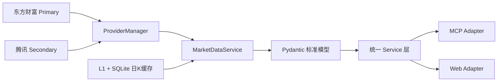
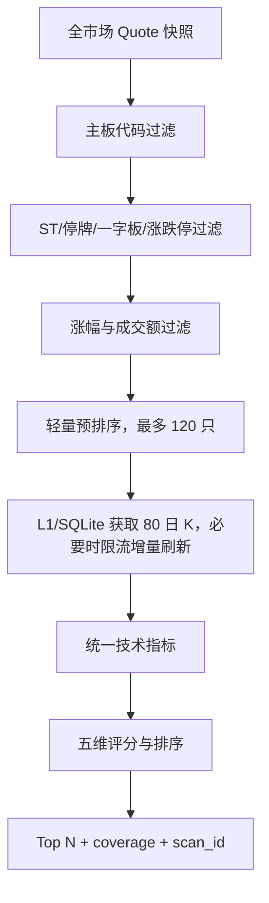

# 开发设计文档

文档版本：1.0  
对应服务版本：1.0.0  
最后更新：2026-08-28

## 1. 项目目标

本项目是只读的 A 股事实行情服务，为 ChatGPT 和其他客户端提供两种访问方式：

- Streamable HTTP MCP：适合模型工具调用。
- HTTP JSON Web API：适合无法直接使用 MCP 的 GPT 或普通 HTTP 客户端。

两种入口只是传输适配器，不是两套行情系统。它们必须读取完全相同的标准模型、缓存快照、技术指标和扫描结果。

非目标包括账户、资金、下单、券商 API、投资组合、数据库、机器学习、新闻和 Level-2 行情。

## 2. 核心设计原则

### 2.1 单一事实源

系统的数据路径固定为：



必须保持以下约束：

1. `f43`、`f170` 或腾讯 `~` 字段只能在对应 Provider 中解析。
2. 价格、百分比和成交量缩放只能在 Provider 中执行一次。
3. MCP 和 Web 不得直接请求东方财富。
4. MCP 和 Web 不得自行计算质量、指标或评分。
5. 两种入口必须使用 `app.container.container` 中的同一组单例服务。
6. 成功业务对象统一由 `serialize_business()` 序列化。

### 2.2 准确性优先

以下情况返回显式错误或不可用状态，禁止猜测和静默兜底：

- 行情源超时、断连或返回空数据。
- 价格单位或字段含义无法确认。
- 源时间异常或行情超过新鲜度阈值。
- K 线不足以计算某项指标。

实时价不得由昨收、历史网页数据或旧缓存替代；缺失的量比、换手率和涨跌停数量保持 `null`。

## 3. 模块结构

| 模块 | 责任 |
|---|---|
| `app/providers/` | Provider 抽象、双源请求、健康切换、代码转换与标准化 |
| `app/kline_cache.py` | 日 K 的 L1 内存与 L2 SQLite 持久化缓存 |
| `app/models.py` | 统一业务模型和响应契约 |
| `app/cache.py` | 进程内 TTL 缓存与同键并发合并 |
| `app/services/data_quality.py` | 唯一的数据质量、置信度和快照 ID 计算入口 |
| `app/services/technical_indicator_service.py` | 技术指标统一调用入口 |
| `app/services/quote_service.py` | 单股和批量行情编排 |
| `app/services/kline_service.py` | K 线与单股详情编排 |
| `app/services/market_data_service.py` | 业务层唯一数据依赖、日 K 缓存与网络刷新策略 |
| `app/services/market_service.py` | 指数、涨跌家数和市场成交额 |
| `app/services/sector_service.py` | 行业/概念排名 |
| `app/services/scanner.py` | 主板过滤、指标丰富、评分和覆盖率 |
| `app/mcp/server.py` | 8 个只读 MCP tools |
| `app/api/routes.py` | REST 调试接口和受保护的 GPT Web Adapter |
| `app/serialization.py` | MCP/Web 共用序列化 |
| `app/main.py` | 生命周期、异常处理、MCP 挂载和 Bearer 边界 |

## 4. 运行时对象关系

`Container` 在进程内只创建一次，持有：

- 一个 `AsyncTTLCache`；
- 一个 `DataQualityService`；
- 一个 `TechnicalIndicatorService`；
- `EastmoneyProvider`、`TencentProvider` 和 `ProviderManager`；
- 一个 `KlineCache` 与一个 `MarketDataService`；
- Quote、Kline、Market、Sector、Scanner 五类服务。

当前部署必须保持 Uvicorn 单 worker。SQLite 日 K 可跨进程重启保留，但 L1、Quote、扫描和 Live 快照不跨 worker、容器或主机共享；如果未来需要多副本，应先迁移共享缓存和快照协调，否则无法保证跨实例 snapshot parity。

## 5. Provider 设计

### 5.1 证券代码映射

`to_eastmoney_secid()` 根据市场规则生成东方财富 `secid`：

- 上海：`600519 → 1.600519`
- 深圳：`002284 → 0.002284`
- 北交所代码被识别为 BJ，但主板扫描会排除。

输入必须是六位数字，未知前缀直接拒绝。

腾讯的转换独立位于 `TencentProvider`：上海 `603019 → sh603019`，深圳 `002284 → sz002284`。业务层始终只使用六位代码。

### 5.2 Quote 标准化

Provider 请求 `fltt=2` 时使用已缩放值；探针使用 `fltt=1` 验证原始缩放。统一业务单位：

- 价格：元。
- 涨跌幅、换手率、振幅：百分比数值。
- 成交量：股，源端“手”乘以 100。
- 成交额：元。
- 时间：带 `Asia/Shanghai` 时区的 ISO 8601。

详细字段映射见 [东方财富字段实测记录](eastmoney_fields.md)。

### 5.3 K 线标准化

支持 `1m/5m/15m/30m/60m/day/week/month`，统一输出时间、OHLC、成交量和成交额。Provider 同时兼容已实际观察到的两种 `klines` 编码：

- JSON 字符串数组；
- 以空格分隔的字符串。

无法得到有效行时抛出 `ProviderEmptyDataError`，不会返回空对象伪装成功。扫描日 K 在两个源都统一为 `qfq`：Eastmoney `fqt=1`，Tencent `qfqday`。

### 5.4 HTTP 策略

- 共享 `httpx.AsyncClient` 和 Keep-Alive 连接池。
- 默认单次超时 5 秒；ProviderManager 对每个源最多尝试 2 次。
- 第一次失败后随机退避 0.2–0.5 秒，源内重试耗尽后切备用源。
- 主机异常时按既定顺序尝试 `push2`、`push2delay`、`push2his` 节点。
- 所有重试均失败后返回明确 provider error。

## 6. 时间、质量与快照

### 6.1 时间语义

| 字段 | 含义 |
|---|---|
| `source_timestamp` | 兼容字段；f86/f124 仅按 Provider 更新时间解释，不得称为最后成交时间 |
| `data_timestamp` | 兼容字段，当前始终等于 `source_timestamp` |
| `server_timestamp` | 本次标准行情对象创建时间 |
| `age_seconds` | `server_timestamp - source_timestamp`，最小为 0 |
| `timestamp_source` | `eastmoney` 或 `fetch_time` |

仅当源端确实没有时间字段时才使用抓取时间，并明确标记 `timestamp_source=fetch_time`。

### 6.2 质量规则

质量只由 `DataQualityService` 计算：

| 数据年龄 | quality | stale | confidence |
|---:|---|---|---|
| ≤ 30 秒 | `LIVE` | false | 字段完整且源时间可靠时 `HIGH` |
| 30–60 秒 | `STALE` | true | 通常 `HIGH` |
| 60–300 秒 | `OLD` | true | `LOW` |
| > 300 秒 | `UNAVAILABLE` | true | `LOW` |
| 数据源冲突 | `CONFLICT` | true | `LOW` |

字段不完整或只能使用抓取时间时，置信度最多为 `MEDIUM`。`CONFLICT` 已在 schema 中预留，当前版本尚未接入第二行情源。

### 6.3 snapshot_id 和 scan_id

`snapshot_id` 根据标准化源时间确定性生成：

```text
snapshot-YYYYMMDDTHHMMSS.mmm
```

同一缓存对象通过 MCP 与 Web 返回时，ID 和全部业务字段相同。扫描结果另带：

```text
scan-YYYYMMDDTHHMMSS.mmm
```

每个扫描候选还保留其行情 `snapshot_id`，便于判断候选和单股详情是否来自同一行情批次。

## 7. 缓存与并发

`AsyncTTLCache` 使用单键 `asyncio.Lock` 合并并发加载，避免缓存失效瞬间重复请求同一数据。规范缓存键与 TTL：

| 数据 | 缓存键 | TTL |
|---|---|---:|
| 单股行情 | `quote:{code}` | 3 秒 |
| 指数行情 | `index:{market}:{code}` | 3 秒 |
| 日 K | L1 + `data/kline_cache.sqlite3` | 交易时 300 秒；非交易时 1800 秒 |
| 分钟/周/月 K | `kline:{code}:{period}:{limit}` | 分钟 5 秒；其他仍由 Provider TTL 控制 |
| 单股详情 | `detail:{code}` | 3 秒 |
| 全市场列表 | `market:all-a-shares` | 3 秒 |
| 市场概况 | `market:latest` | 5 秒 |
| 板块排名 | `sector:{type}:{limit}` | 10 秒 |
| 主板扫描 | `scan:mainboard:{canonical-params}` | 15 秒 |

全市场列表完成标准化后会批量填充 `quote:{code}`，使紧邻的市场、扫描和单股查询尽量复用同一 Quote 快照。

扫描缓存键会先规范化数值类型，确保 MCP 的整数默认值与 FastAPI 的浮点默认值不会生成两个键。这一不变量由单元测试覆盖。

## 8. Service 设计

### 8.1 QuoteService

只做输入编排。批量请求去重、限制最多 100 个代码，并通过 `asyncio.gather` 并发获取，不串行逐股请求。

### 8.2 KlineService

单股详情并发获取：

- 当前 Quote；
- 120 根日 K；
- 48 根 5 分钟 K。

随后调用共享 `TechnicalIndicatorService`，生成 MA5/10/20/60、ATR14、RSI14、20/60 日高低点、位置距离和阶段收益。详情继承 Quote 的质量字段和 `snapshot_id`。

### 8.3 MarketService

并发读取全市场列表与上证、深证、创业板指数。涨跌家数和总成交额只由同一份标准化全市场列表聚合。未可靠验证的涨跌停家数返回 `{value: null, available: false}`。

### 8.4 SectorService

返回行业或概念板块排名。源端没有可靠数据的涨停数量和历史名次字段保持 `null`。

### 8.5 ScannerService

主板扫描流程：



主板前缀：`000/001/002/003/600/601/603/605`。创业板、科创板、北交所、ST/退市、停牌、一字板、低成交额和涨跌停不可交易标的被排除。

评分上限 100：

- 趋势 25：价格高于 MA20、MA5 高于 MA20、MA20 高于 MA60。
- 量能 20：量比和成交额的有界评分。
- 相对强度 20：个股涨幅相对所属市场指数。
- 位置 20：奖励当日 0%–3%、靠近 MA20 且未贴近 20 日高点；连续大涨扣分。
- 流动性 15：成交额、换手率和非一字板状态。

K 线丰富失败时先由腾讯接管；双源失败时使用足量旧缓存。只有双源失败且无足量缓存才不计算技术指标，并在候选中附加“K线不可用，趋势指标未计分”。每次实际扫描以聚合 `SCAN SUMMARY` 输出来源、缓存命中、异常分类和 MA 可用数量，不逐股刷日志。

## 9. 传输适配器

### 9.1 MCP Adapter

FastMCP 挂载在 `/mcp/`，由独立 ASGI 中间件校验 `Authorization: Bearer <MCP_TOKEN>`。工具异常转换为 `ErrorResponse`，不会让 MCP 会话崩溃。

### 9.2 Web Adapter

受保护端点位于 `/gpt/{secret}/...`。`secret` 使用 `GPT_WEB_SECRET`，未设置时回退到 `MCP_TOKEN`。正确结果外层为：

```json
{"ok": true, "data": {}}
```

其中 `data` 与 MCP 工具业务结果使用同一 Pydantic 模型和序列化函数。密钥错误返回 404，避免泄漏端点存在性；未配置任何密钥返回 503。

路径密钥会出现在 URL 中，因此生产容器关闭 Uvicorn access log，Nginx `/gpt/` location 也关闭 access log。

Live Refresh Adapter 位于同一 Web 传输层：入口、快照、个股详情都返回 HTML，并以 `secrets.token_urlsafe(24)` 为每个后续链接生成唯一 URL。后台唯一任务调用现有单例 `MarketService`、`ScannerService` 与 `QuoteService`，完成后以一次引用赋值原子替换内存快照；交易时段完成一次刷新后等待 2 秒，非交易时段等待 30 秒。现有 Service 缓存 TTL 继续控制 Provider 的真实采集频率。

HTTP 请求只读取当前引用并渲染，绝不 await Service 或 Provider。刷新失败只更新错误状态，不清空成功快照；进程启动后首份快照未完成时立即返回 `INITIALIZING`。该缓存属于只读 Web 展示物化视图，不拥有 Provider、行情计算或扫描计算。页面使用 `provider_timestamp`、`fetch_timestamp`、`market_timestamp` 与 `timestamp_semantics` 明示时间语义；既有 MCP/JSON 合约保持不变。

成功刷新还会在线程中预生成市场 HTML 模板及每只候选股的详情模板，然后把行情对象、模板和错误状态作为一个不可变状态用单次引用赋值发布。模板仅保留 `server_time`、`age_ms`、状态、warning、secret 和 nonce 占位符。HTTP handler 没有 `await`、Future、Event、业务缓存或锁，只读取一次状态引用并替换这些小型动态占位符。响应头 `X-Live-Cache: HIT|MISS` 可直接确认是否命中成功快照。

## 10. 异常契约

| 场景 | REST/Web | MCP |
|---|---|---|
| 输入值错误 | HTTP 400/422 JSON | 结构化 `ok=false` |
| 行情源失败 | HTTP 503 JSON | 结构化 `ok=false` |
| 未知内部错误 | HTTP 500，仅暴露异常类型 | 结构化错误 |
| MCP Token 错误 | HTTP 401 + `WWW-Authenticate: Bearer` | 无法建立工具会话 |
| Web secret 错误 | HTTP 404 | 不适用 |

日志、文档和 Git 历史不得包含真实 token、Web secret 或服务器密码。

## 11. 扩展设计

未来增加新浪等更多数据源时，应实现 `MarketDataProvider`，在 Provider 内完成该源的独立字段验证和标准化，并注册到现有 `ProviderManager`。后续可继续完成：

1. 主源健康检查与熔断；
2. 同时间窗口价格交叉核验；
3. 差异阈值和 `CONFLICT` 判定；
4. `confidence` 调整；
5. 禁止把不同时间点、不同来源字段无提示拼成一个 Quote。

增加多 worker 或多实例前，必须先解决共享缓存、分布式锁、快照 ID 和扫描任务协调。

## 12. 已知限制

- 东方财富公开页面接口没有服务可用性和字段稳定性承诺。
- 部分网络出口会被 `push2his` 断开，或得到空 K 线；此时腾讯自动接管。双源都失败时日 K 可显式返回旧缓存并标记 `stale/OLD`，不会冒充实时数据。
- Quick Tunnel 地址在服务重启后可能变化，不适合作为正式固定入口。
- Quick Tunnel 对持续 SSE 没有生产保证；正式环境应使用 Named Tunnel 或自有域名。
- 当前静态 Bearer 适合受控客户端；正式 ChatGPT 连接建议升级标准 OAuth discovery。
- 内存缓存只在单进程内共享。
- 扫描是事实筛选和启发式排序，不构成投资建议。

## 13. 变更检查清单

涉及行情字段、缩放、时间、缓存键、技术指标或扫描评分的变更，合并前必须：

1. 先运行探针并保存可审计的原始样本；
2. 更新字段文档和 Provider fixture；
3. 运行全部单元测试；
4. 运行 `tests/test_mcp_web_parity.py`；
5. 对 002284、600722、600519、000001 做价格缩放核验；
6. 通过真实 MCP initialize、tools/list、tools/call；
7. 在同一进程中比较 MCP/Web 的 snapshot_id、指标、候选顺序、评分和 scan_id；
8. 确认任何失败都没有旧值或猜测数据兜底。
