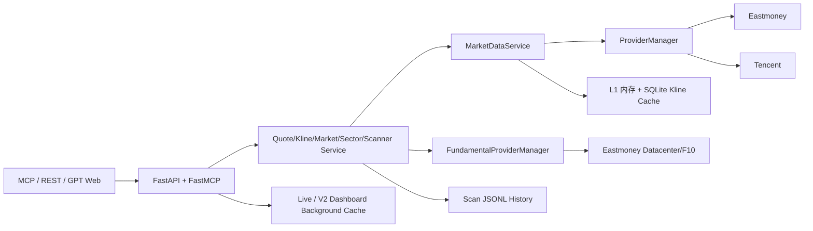
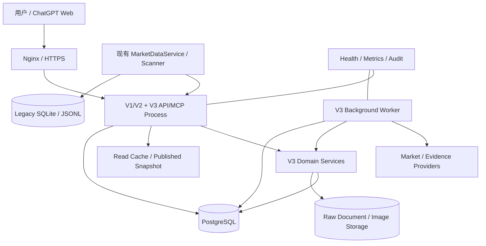

# gpt-market V3 技术架构设计

> 基线：V3 Architecture Baseline 1.0
> 状态：目标架构，包含当前实现对照；PostgreSQL、V3 Worker 和 V3 模块尚未实现。

## 1. 目标与约束

技术架构必须支持：现有 V1/V2 不停机兼容、全市场时点数据、可重放 Feature/Recall、ChatGPT Web READ 与人工导入、不可变决策/交易记录、严格审计和快速回滚。

约束：

- Python 3.12；
- 当前 FastAPI + FastMCP 保留；
- 当前 AI 客户端是 ChatGPT Web，不调用模型 API；
- 当前单机 Linux/Docker 部署可以继续使用；
- V3 正式状态采用 PostgreSQL，不能继续依赖内存或 JSONL；
- 外部行情和 Evidence Provider 均不稳定，必须显式降级；
- 真实资金写入必须有人类确认。

## 2. 当前技术架构（已实现）



### 2.1 当前栈

| 层 | 技术 | 状态 |
|---|---|---|
| Web/API | FastAPI、Pydantic v2 | 已实现 |
| MCP | FastMCP Streamable HTTP | 已实现 |
| HTTP Client | httpx async | 已实现 |
| 计算 | numpy、pandas | 已实现 |
| 缓存 | AsyncTTLCache、进程内 Snapshot | 已实现 |
| Kline 存储 | SQLite WAL | 已实现 |
| 扫描历史 | JSONL | 已实现 |
| 部署 | Docker、Uvicorn、Nginx | 已实现 |
| V3 正式数据库 | PostgreSQL | 待实现 |
| Migration | Alembic 或同等工具 | 待选型/待实现 |
| V3 Worker/Scheduler | 独立进程 | 待实现 |

### 2.2 当前代码依赖方向

```text
api / mcp
  → service
    → MarketDataService / FundamentalProviderManager
      → Provider adapter
        → 外部数据源
```

Provider 只负责传输、解析、代码转换和单位标准化；业务入口不得直接调用具体 Provider。`Container` 负责单例装配和生命周期。

## 3. V3 目标运行架构



### 3.1 进程职责

- **API/MCP Process**：只处理 READ、导入预览、用户确认和轻量查询；不在请求路径执行全市场抓取；
- **Worker**：Universe、Bar、Feature、Recall、Evidence、Market Regime、Performance 和 Expected Run 状态任务；
- **PostgreSQL**：V3 正式状态、版本、时点和审计；
- **File/Object Storage**：Raw Document、截图和大体积原始响应；
- **Legacy Runtime**：V1/V2 保持原 Service 与缓存，通过 Feature Flag 与 V3 隔离。

第一阶段允许 API 与 Worker 在同一容器不同任务中启动，但边界和数据库契约必须按可拆分进程设计；全市场作业稳定后优先拆为独立 Worker。

## 4. 分层架构

### 4.1 Interface Layer

`app/v3/api`、现有 MCP/REST、HTML 展示。负责认证、参数校验、Schema 序列化、HTTP 错误映射，不包含 Provider 逻辑和决策计算。

### 4.2 Application Layer

编排用例：Build Feature Run、Query Universe、Build Context、Import Bundle、Confirm Trade Draft、Replay Strategy。负责事务边界和权限检查。

### 4.3 Domain Layer

包含 Evidence、Task、Decision、Watchlist、Trade Ledger、Portfolio、Performance 等业务不变量。不得依赖 FastAPI、httpx、模型 SDK或具体数据库驱动。

### 4.4 Infrastructure Layer

Repository、PostgreSQL、Migration、Provider Adapter、Raw File Store、Cache、Scheduler、Clock、ID 和 Hash 实现。

依赖方向始终从外向内：Interface/Infrastructure 依赖 Application/Domain，Domain 不反向依赖框架。

## 5. 建议代码结构

```text
app/v3/
├── api/                 # router、dependency、HTTP schema
├── application/         # use case / transaction orchestration
├── contracts/           # AgentTask、Envelope、Bundle、Result schema
├── domain/              # entity、value object、policy、invariant
├── repositories/        # repository protocol
├── infrastructure/
│   ├── db/              # PostgreSQL implementation
│   ├── providers/       # Universe/Evidence adapter
│   ├── storage/         # raw/image storage
│   └── scheduling/
├── services/            # feature、recall、context、performance
└── tasks/               # background jobs
```

现有 `app/providers`、`app/services`、`app/mcp` 和 `app/api` 初期不重构，只通过适配器或明确边界被 V3 复用。

## 6. 数据处理架构

### 6.1 Market Pipeline

```text
Universe Snapshot
→ Raw Bar / Quote Fetch
→ Normalize + Quality
→ Revision Publish
→ Feature Run
→ Market Regime
→ Multi-Recall / Raw
→ Candidate Comparison
```

网络调用、解析和计算在锁外完成；仅发布不可变 Snapshot 或 Cache Reference 时短暂原子交换。HTTP Handler 不能等待 Refresh Future/Event。

### 6.2 Evidence Pipeline

Provider Fetch 先保存 Raw Document，再解析标准 Evidence。Dedup、Entity Link、Conflict 和 Retrieval 均可按 Raw Hash/Parser Version 重放。Core 和 Extended 使用相同管线但不同任务优先级。

### 6.3 AI Result Pipeline

```text
Upload Single/Bundle → Parse → Group Validation → Batch Preview
→ One User Confirmation → Per Atomic Group Transaction
→ Successful/Failed Group Result → Task/Audit Update
```

同组严格原子，不同组容错隔离。Confirm 绑定 Bundle Hash、Preview Revision 和 Idempotency Key。

### 6.4 Trade Pipeline

```text
Manual/Image → Draft → User Confirm
→ Immutable Ledger / Opening / Reconciliation
→ Projection Rebuild → Portfolio Context
```

OCR、AI 和外部 Agent 都不能绕过 Draft 与用户确认。

## 7. 并发与一致性

- 使用数据库唯一约束和幂等键防止重复导入；
- Atomic Group 使用独立事务；
- Ledger 追加使用账户/证券维度串行化或乐观版本检查；
- Feature Run、Context Pack、Decision 等完成后不可变；
- 长任务使用 Run 状态和断点游标，禁止持有数据库长事务；
- Cache 发布使用不可变对象引用交换；
- 读取可使用快照隔离，资金写入使用更严格行锁/版本检查；
- 所有时间由 Clock 接口提供，测试可冻结时间。

## 8. 缓存架构

| 缓存 | 当前 | V3 策略 |
|---|---|---|
| Quote/Market/Sector | 进程 TTL | 保留，数据带 Snapshot/Quality |
| Live HTML | 后台预序列化内存 | 保留，不等待 Provider |
| Kline | L1 + SQLite | Legacy 保留；V3 正式 Bar 进入 PostgreSQL |
| Feature/Recall | 无正式缓存 | 按不可变 Run ID 查询，可加只读缓存 |
| Context Pack | 无 | 生成后持久化并按 Hash 读取 |
| Portfolio Projection | 无 | 数据库投影缓存，可从 Ledger 重建 |

缓存失败不能清空最近成功事实；但陈旧必须显式标记。缓存不是事实来源，持久化 Revision/Ledger 才是 V3 可重放事实。

## 9. 安全架构

- MCP Bearer 与 GPT Web Secret 保留现状，短期不阻塞核心闭环；
- V3 WRITE 仅允许认证的人类 UI；
- READ Scope 预留 Market 与 Portfolio 分离；
- URL Secret 不写访问日志，文档/截图/Envelope 做敏感信息过滤；
- Raw Web/News 内容仅作为数据，不进入系统 Prompt 指令区；
- 图片存储使用不可猜 ID、Hash 和访问控制；
- 数据库账户最小权限，Migration 与 Runtime 账户分离；
- 审计记录操作者、来源、请求 ID、对象 Hash 和结果，但不记录明文 Secret。

## 10. 可观测性

统一日志字段：`request_id`、`task_run_id`、`feature_run_id`、`provider`、`operation`、`duration_ms`、`status`、`error_type`、`cache_state`。

指标至少覆盖：

- Provider 成功率、延迟、熔断和 Fallback；
- Universe/Quote/Bar/Evidence Coverage 与 Freshness；
- Worker Queue/Run 耗时和失败；
- Context 大小与裁剪；
- Bundle 成功/失败组数；
- Ledger/Projection 一致性；
- READ API P50/P95/P99；
- Expected Run 的 Pending/Missed 数。

审计日志和运行日志分离。审计不可随普通日志轮转丢失。

## 11. 部署架构

### 11.1 当前

单 Docker 容器、`127.0.0.1:8000`、Nginx 80 反向代理，可选 Cloudflare Tunnel。`./data:/data` 持久化 SQLite/JSONL。

### 11.2 V3 目标

Docker Compose 至少包含：

- `market-api`；
- `market-worker`；
- `postgres`；
- 可选 `backup`/对象存储适配器。

Nginx 继续代理 API；数据库不暴露公网。PostgreSQL Volume、Raw 文件目录和备份目录独立。Migration 在发布前显式执行，不能由多个 API Worker 竞争自动运行。

## 12. 性能与容量

- 约 5,905 证券 × 300 日约 177 万 Bar；
- 每年约 148 万全市场 Feature Row；
- PostgreSQL 首年预留 8–20GB；
- 全市场 Feature 不以 2 秒频率重算；
- 分钟 K 不做全市场长期保存；
- 常用 READ P95 < 200ms，复杂 Query/Context P95 < 500ms；
- 全市场任务通过批量 I/O、受控并发和增量计算完成。

## 13. 兼容与回滚

- `/mcp`、V1/V2 REST/GPT 路由保持不变；
- V3 只新增 `/api/v3` 和独立 Schema；
- 旧 SQLite/JSONL 只迁移副本，不就地破坏；
- 新数据先 Shadow 双写/比对；
- Feature Flag 可关闭 V3 Router/Worker；
- Migration 必须有备份和恢复路径；
- 故障时继续运行冻结 V2 基线。

## 14. 技术决策待确认

| 项目 | 当前决定 |
|---|---|
| PostgreSQL 驱动/ORM | `UNKNOWN`，Phase 1 评估 SQLAlchemy async 或轻量 Repository 实现 |
| Migration 工具 | 建议 Alembic，Phase 1 确认 |
| Scheduler | `UNKNOWN`，先以数据库 Run Registry + Worker Loop，避免过早引入队列 |
| Raw/Image Storage | 初期本地受控目录，接口预留对象存储 |
| OCR 引擎 | `UNKNOWN` |
| Secondary Universe Provider | `UNKNOWN` |
| 正式交易日历 Provider | `UNKNOWN` |

未知项必须在实施验证后记录 ADR，不能在设计文档中猜测。
