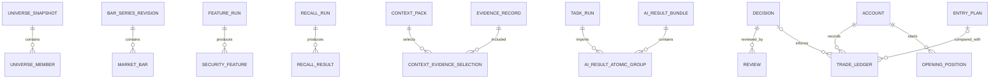

# gpt-market V3 数据库设计

> 基线：V3 Architecture Baseline 1.0
> 状态：逻辑设计基线，尚未创建 PostgreSQL Migration。
> 命名说明：以下字段为建议最小集合；Phase 1 必须经实际 ORM/SQL 选型后形成物理 DDL。

## 1. 设计目标

- 保存全市场时点事实和修订；
- 支持 `known_at` 严格 Replay；
- 保存 Agent Context、结果和完整身份；
- Decision/Review/Trade 不可变；
- Bundle 按 Atomic Group 提交；
- Portfolio 可从 Ledger 重建；
- 所有状态可审计、可迁移、可回滚。

## 2. 当前存储现状

### 2.1 SQLite Kline

当前 `KlineCache` 包含：

- `kline_bars`：`symbol + period + adjust + trade_date` 主键，保存 OHLCV、amount、source、provisional、updated_at；
- `kline_series`：序列来源与更新时间；
- WAL 模式和进程内 L1 缓存。

限制：当前表对同一交易日执行 Upsert，不保留完整 Revision；主要存标准化/复权序列，不足以证明严格 Point-in-Time。

### 2.2 JSONL Scan History

按交易日保存 V1/V2 Scan Result、输入参数和未来收益占位。限制：无事务、无外键、查询与幂等能力弱。

### 2.3 内存状态

Quote/Market/Scan TTL、LiveSnapshot、V2Dashboard State 和 Provider Health 重启丢失，不可作为 V3 正式状态。

## 3. PostgreSQL 通用约定

### 3.1 类型与时间

- ID：UUID；
- 证券代码：`varchar(16)`，标准 A 股代码另带市场；
- 时间：`timestamptz`，统一存绝对时间，展示时转换 Asia/Shanghai；
- 交易日：`date`；
- 金额/价格：`numeric`，禁止用二进制浮点保存真实成交；
- 灵活但需审计的 Payload：`jsonb`；
- Hash：SHA-256 十六进制或 `bytea`；
- 状态枚举优先数据库 Check + 应用 Enum，避免难迁移的数据库 Enum。

所有时点事实区分：

```text
event_time / report_period
publish_time
fetch_time
known_at
created_at
```

### 3.2 不可变约定

Decision、Review、MarketReview、Trade、Evidence Raw、Feature Run、Context Pack 完成后禁止 UPDATE 业务内容。纠错使用 Correction/Revision/Replacement 记录。数据库权限和 Trigger 可在稳定后增加不可变保护。

## 4. 数据域关系总览



## 5. Universe 与证券主数据

### 5.1 `securities`

`security_id` PK，`code`，`market`，`name`，`security_type`，`list_date`，`delist_date`，`created_at`。唯一键 `(market, code)`。

### 5.2 `universe_sources`

Provider 标识、类型、启用状态、优先级配置和能力版本。

### 5.3 `universe_snapshots`

`snapshot_id` PK，`source_id`，`as_of`，`fetch_time`，`known_at`，`coverage`，`stale`，`content_hash`，`previous_snapshot_id`，`status`，`error`。

### 5.4 `universe_members`

`snapshot_id + security_id` PK，保存名称、交易状态、ST/风险、停牌、新股/退市标记和 Raw Reference。

### 5.5 `universe_diffs`

记录前后 Snapshot 的 `ADDED/REMOVED/CHANGED`、旧值、新值和原因。

索引：`universe_snapshots(as_of desc)`、`universe_members(security_id, snapshot_id)`。

## 6. Bar、公司行动与 Feature

### 6.1 `bar_series_revisions`

`revision_id`，`security_id`，`period`，`adjust_type`，`source`，`upstream_source`，`raw_bar_available`，`factor_revision_id`，`point_in_time_precision`，`known_at`，`content_hash`，`supersedes_revision_id`，`status`。

### 6.2 `market_bars`

建议主键 `(revision_id, bar_time)`，字段 OHLC、volume、amount、provisional、event_time、fetch_time。不得覆盖旧 Revision。

### 6.3 `corporate_actions`

事件类型、登记日/除权日、公告时间、known_at、比例/金额、来源、Evidence ID 和 Revision。

### 6.4 `adjustment_factor_revisions` / `adjustment_factors`

保存 Factor 序列的来源、known_at、内容 Hash 和每交易日因子。派生前复权 Bar 必须绑定 Factor Revision。

### 6.5 `feature_runs`

`feature_run_id`，`as_of`，Universe Snapshot、Bar Revision Set、Feature Version、状态、起止时间、Coverage、错误摘要、Content Hash。

### 6.6 `security_features`

主键 `(feature_run_id, security_id)`，高频查询字段使用类型化列，扩展字段可放 `features jsonb`。至少保存质量、缺失字段和输入 Hash。

索引/分区：`market_bars` 按年份或时间范围分区；`security_features(feature_run_id, security_id)`；常用排序字段可按实际 Query 建表达式/覆盖索引，禁止预先为所有 JSON 字段建索引。

## 7. Market Regime、Recall 与 Comparison

### 7.1 `market_regime_snapshots`

绑定 `feature_run_id`，保存指数、宽度、成交额、涨跌停结构、风格、轮动、风险 Evidence、Coverage 和 Hash。只保存事实。

### 7.2 `recall_channels`

通道代码、版本、配置、启用状态和说明。

### 7.3 `recall_runs` / `recall_results`

Run 绑定 Feature/Regime/Strategy Version；Result 保存证券、通道、rank、strength、原因和命中特征。唯一键避免同一 Run/Channel/Security 重复。

### 7.4 `recall_miss_evaluations`

保存评价 Horizon、阈值版本、未来表现、是否命中、漏失类型和成熟时间。窗口未成熟不能写最终评价。

### 7.5 `candidate_comparison_packs` / `candidate_comparison_members`

Pack 保存 Candidate Set、Snapshot/Run IDs、字段 Profile、Coverage、裁剪和 Hash；Member 保存证券、原顺序和紧凑 Feature Payload。

## 8. Evidence 与 Context

### 8.1 `evidence_sources` / `evidence_fetch_runs`

保存 Provider、Source Type、能力、任务窗口、请求状态、限流和错误。

### 8.2 `raw_documents`

`raw_document_id`，来源、原始引用、对象存储路径、MIME、fetch_time、known_at、content_hash、parser_status。内容大时不直接放数据库。

### 8.3 `evidence_records`

标准 Evidence：类型、subject、命题/结构化数据、event/publish/fetch/known_at、confidence、relevance、decay、expire_at、conflict_state、raw_document_id、parser_version、content_hash。

### 8.4 `evidence_entity_links` / `evidence_conflicts`

Entity Link 保存实体类型/ID、匹配依据和置信度；Conflict 保存冲突命题、Evidence 集合、状态和处理说明，不删除任何来源记录。

### 8.5 `context_packs`

`context_pack_id`，类型/级别、subject、as_of、Snapshot/Feature/Regime IDs、Token Budget、实际大小、裁剪说明、payload/reference、content_hash、created_at。

### 8.6 `context_evidence_selections`

主键 `(context_pack_id, evidence_id)`，保存 selection_reason、side、retrieval_score、relevance、source_priority 和最终顺序。

## 9. Agent、Task 与 Bundle

### 9.1 `task_profiles`

Profile Code + Version，Schedule、Timezone、Trading Calendar、Context Level、候选/TopK、输出 Schema、宽限期、Strategy Version 和启用状态。

### 9.2 `expected_runs` / `task_runs`

Expected 保存理论任务时间与状态；Task Run 保存实际用户触发/待导入/完成/错过状态、Context 和结果。Expected 不代表 AI 已执行。

### 9.3 `agent_tasks`

保存 Task Contract、subject、trigger、as_of、Context Hash、约束和期望结果类型。

### 9.4 `ai_result_bundles`

Bundle Hash、Agent Identity、produced_at、Preview Revision、Idempotency Key、确认人/时间和整体状态。

### 9.5 `ai_result_atomic_groups`

`group_id`，`bundle_id`，subject、group_hash、validation_status、commit_status、error、retry_of_group_id。唯一键 `(bundle_id, group_id)`。

### 9.6 `ai_result_envelopes` / `ai_result_dependencies`

保存每个 Result 的 Schema、Payload Hash、Context/Evidence/Task 引用和组内依赖。跨组不得依赖尚未创建对象。

## 10. Decision、Watchlist 与 Review

### 10.1 `watchlists` / `watchlist_events`

Watchlist 保存当前投影；每次状态变化写 Event。当前状态可由 Event 重建或校验。

### 10.2 `decisions` / `decision_corrections`

Decision 保存完整 Agent Identity、Task/Context/Feature/Recall、Evidence、Thesis、Risk、Horizon 和 Hash。Correction 只追加旧值、新值、原因和操作者。

### 10.3 `entry_plans`

计划区间、Trigger、Cancel Condition、Stop/Target、Quantity/Position Suggestion、Horizon、Decision ID、版本和状态。

### 10.4 `reviews`

绑定 Decision、Previous Review、Context、Evidence、状态、建议和 Hash，只追加。

### 10.5 `market_reviews`

绑定 Task Run、Market Regime、Context、Evidence、Agent Identity、as_of、结论、风险、关注行业和 Previous MarketReview，只追加。

## 11. Account、Trade 与 Portfolio

### 11.1 `accounts`

账户 ID、名称、币种、成本法、状态。敏感券商标识单独加密或不保存。

### 11.2 `opening_positions`

系统接管前基准数量、平均成本、基准时间、来源、确认人和 Evidence。唯一/版本约束避免重复建立基准。

### 11.3 `trade_ledger`

`trade_id`，account/security、side、trade_time、price、quantity、fee、source/reference、Decision/EntryPlan、执行匹配与偏差、created_at。禁止 UPDATE/DELETE。

### 11.4 `trade_corrections`

对原 Trade 的 Reverse/Correction，保存原因、替代值和人工确认。原 Trade 保留。

### 11.5 `reconciliations`

券商事实与 Projection 的差异、对账时间、原因、调整方式、证据和确认人。未知原因保持 UNKNOWN。

### 11.6 `position_projections` / `portfolio_snapshots`

Projection 保存数量、成本、收益和版本，带 `last_ledger_sequence`；Snapshot 用于历史分析。Projection 可删除重建，不是 Ledger 替代品。

### 11.7 `portfolio_preferences`

保存用户软偏好及版本，不作为数据库硬筛选约束。

## 12. Performance、Replay 与 Strategy

`performance_observations` 保存成熟 Horizon 的行情结果；`performance_summaries` 保存按 Regime/Channel/Strategy/Decision 模式聚合；`regression_cases` 保存输入要求和阻塞原因；`replay_runs` 保存 as_of、Revision Set、结果和泄漏检查；`strategy_versions`、`strategy_proposals`、`strategy_experiments`、`guardrail_versions` 保存版本、审批、Shadow 和回滚关系。

## 13. Audit 与运维表

### 13.1 `audit_events`

`audit_id`，actor_type/id，action，object_type/id，request_id，before_hash，after_hash，result，event_time，metadata。不得记录 Secret。

### 13.2 `provider_health_events`

Provider、能力、延迟、结果、错误类型、熔断状态和时间。高频指标可进入 Metrics 系统，关键状态变更入库。

### 13.3 `job_runs`

任务类型、版本、游标、状态、尝试次数、起止时间、错误和统计，用于断点续跑。

## 14. 事务与约束

- Atomic Group：单组单事务；组失败不回滚其他组；
- Trade Confirm：Draft 校验、Ledger Append、Projection Update、Audit 同事务；
- Decision/Review：内容不可变，Hash 唯一；
- Feature Publish：只有 Run 完整成功后标记 Published；
- Context Confirm：导入时再次核对 Context Hash；
- Idempotency：Import、Draft Confirm、Trade、Job Run 均有唯一键；
- Foreign Key 默认 Restrict，历史事实禁止级联删除。

## 15. 保留、备份与隐私

- Decision/Trade/Audit/Context Hash 长期保留；
- Raw Document 根据类型设保留期，但 Hash/Metadata 和被引用内容不能先于引用对象删除；
- 图片含敏感信息，独立加密/权限与删除策略；
- 每日 PostgreSQL 备份，发布 Migration 前额外快照；
- 定期执行恢复演练，而不是只验证备份文件存在；
- 生产数据不得复制进 Git 或测试 Fixture。

## 16. V2 迁移映射

| 当前数据 | V3 目标 | 迁移语义 |
|---|---|---|
| SQLite `kline_bars` | Bar Revision | `LEGACY_APPROX`，保留 adjust/source/updated_at |
| SQLite `kline_series` | Series Revision Metadata | 不宣称原始时点精确 |
| Scan JSONL | Legacy Scan/Observation | 保留原文件 Hash和缺失项 |
| 内存 Snapshot | 不迁移 | 重启后重新生成 |
| Phase2A Fundamental | Feature/Evidence 输入 | 保留来源、报告期和 Coverage |

迁移只追加到 V3，不修改原 SQLite/JSONL。迁移前后做数量、Hash、样本字段和可回滚验证。

## 17. Phase 1 输出要求

Phase 1 开始后，本设计必须落成：

1. 选型 ADR；
2. PostgreSQL Compose 配置；
3. 初始 Migration 与 Down/Restore 方案；
4. 通用时间、Hash、Audit 和 Repository 基础；
5. 核心表 DDL、索引和约束测试；
6. 已知 UNKNOWN 和后续表的占位 Migration 计划；
7. 数据库备份/恢复验收记录。
