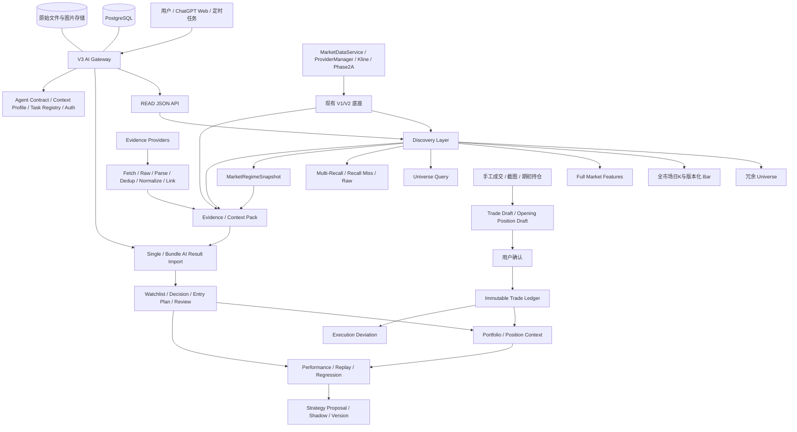

# gpt-market V3 AI 投资决策系统架构设计实施稿 — V3 Architecture Baseline 1.0

> 文档状态：**V3 Architecture Baseline 1.0**
> 设计基线：`556a335 / v2-phase2a-baseline-20260829`
> 适用范围：V3 架构设计，不代表已经实施
> 本文档不修改 V1/V2 行情、扫描、评分、Provider、缓存、MCP 或 Web API 业务逻辑。

## 1. V3 Scope 与 V4 Deferred Scope

### 1.1 V3 Scope

V3 的目标是在当前主要 AI 客户端仍为 ChatGPT Plus 网页版、且不购买模型 API 的前提下，形成可长期使用、可审计、可复盘的投资决策闭环：

`全市场发现 → 深度分析 → 自选观察 → 等待买点 → 真实成交录入 → 持仓分析 → 卖点判断 → Review → Performance → 历史复盘`

V3 纳入：

- 全 A 股统一日 K 数据、全市场轻量特征和 Full Universe Query；
- Multi-Recall、Raw Opportunity、Recall Miss 和全市场异常组合查询；
- Evidence、FAST/NORMAL/DEEP 三级 Context Pack；
- Task Profile、Expected Run、Task Run Registry；
- ChatGPT Web 的可靠 READ 接口和标准化 AI Result Import；
- Watchlist、Entry Plan、Immutable Decision、Append-only Review；
- 手工真实成交、截图识别 Trade Draft、用户确认、Immutable Trade Ledger；
- Portfolio、Position Context、真实持仓分析；
- Selection、Entry、Add、Reduce、Exit、Risk Control 分离评价；
- PostgreSQL 正式状态存储、`known_at` 防前视、审计日志；
- Replay、Regression 和初始 Shadow/A-B 机制。

V3 的最高层职责原则是：**系统负责可验证事实，AI 负责最终综合判断，用户确认真实资金行为。** 服务器提供结构化事实、证据、数据质量和历史统计，但不得用新的固定统一总分替代 AI 的横向分析，也不得把任何机器候选集合变成访问全市场的权限墙。

当前 AI 身份固定表达为：

```text
agent_type = CHATGPT_WEB
provider   = OPENAI
model      = UNKNOWN（网页版无法可靠确认时禁止猜测）
```

### 1.2 V4 Deferred Scope

以下能力推迟到 V4：

- 浏览器 Bridge、Chrome Extension、ChatGPT DOM 监听；
- ChatGPT 网页自动 POST 服务器；
- OpenAI、Claude、Gemini、DeepSeek、Qwen、GLM 等模型 API；
- LLM Gateway、Model Router、Second Opinion、多 Agent Bull/Bear 辩论；
- 无人值守 AI 任务与自动回调；
- 高级 Strategy Proposal/Replay/Shadow 自动化；
- 券商 API、自动成交同步和自动对账。

原因是这些能力需要额外账号、权限、稳定 API、浏览器自动化或真实资金授权。V3 先把事实、上下文、结果契约、人工确认和审计链做稳，避免把尚不存在的能力伪装成可用能力。V3 的 Contract 和 Ingestion API 应允许 V4 复用，但 V3 核心业务不得依赖 V4 组件。

## 2. 更新后的总体架构



硬边界：

- Recall 是发现加速器，不是访问全市场的权限墙；
- AI 建议不是实际持仓；
- Entry Trigger 不是实际买入；
- OCR 识别不是交易事实；
- Strategy Proposal 不是正式生效策略；
- 只有用户确认的真实成交才进入 Trade Ledger。
- 系统特征与 Market Regime 是 AI 输入，不是固定买卖许可；
- Portfolio 事实与用户偏好是上下文，不是删除机会的硬筛选器。

## 3. ChatGPT Web 当前真实交互模式

V3 当前采用“可靠读取 + 结构化导入”：

1. ChatGPT Web 读取服务器 JSON；
2. 服务器提供 Market、Universe、Recall、Evidence、Context、Portfolio 等事实；
3. ChatGPT 按 Agent Contract 输出结构化 Envelope；
4. 用户在站内粘贴或上传该结果；
5. 服务器校验 Schema、Context Pack Hash、Evidence、时点和不变量；
6. 用户一次确认；
7. 服务器在单个事务中写入 Decision、Review、Watchlist、Entry Plan 等低风险状态。

真实成交走独立流程：

`手工输入/截图 → Trade Draft → 用户校对并确认 → Immutable Trade Ledger → Portfolio Projection`

当前不假设 ChatGPT Plus 网页版能够稳定携带 Bearer Token 直接写服务器，也不使用浏览器 Bridge。

### 3.1 系统、AI 与用户的职责边界

服务器负责 Market Data、Universe、K 线、Full Market Features、Multi-Recall、Raw Opportunity、Evidence 整理、Market Regime 事实、Portfolio 事实、Trade Ledger、数据质量、明确风险事实和 Performance 统计。

AI / ChatGPT 负责多候选横向比较、正反 Evidence 分析、Raw 到 Action 的升级判断、Entry Plan、持仓/加仓/减仓/卖点判断和 Review 结论。

用户负责确认真实 BUY/SELL、期初持仓、对账修正和正式 Strategy Activation。系统不得重新引入 `action_total_score`、`final_total_score`、`final_rank_score` 等统一固定总分代替 AI 最终判断。`trend_freshness`、`ignition_quality`、`relative_strength`、`time_efficiency`、位置、波动、资金、流动性和基本面等只能作为结构化输入。

## 4. 未来模型扩展边界

V3 业务层只认识 `AgentTask`、`ContextPack`、`ToolContract`、`AIResultEnvelope` 和结果 Schema，不允许直接导入任何模型厂商 SDK。

V4 可在核心域之外增加：

```text
LLMGateway
├── OpenAIAdapter
├── AnthropicAdapter
├── GeminiAdapter
├── DeepSeekAdapter
├── QwenAdapter
├── GLMAdapter
└── LocalModelAdapter
```

所有 Adapter 必须输出同一 Envelope，继续经过 V3 Ingestion、校验、确认与审计流程。模型调用失败不能影响行情、持仓和人工操作。

## 5. Agent Contract

### 5.1 AgentTask

```json
{
  "task_id": "uuid",
  "task_type": "FIRST_DECISION",
  "subject": {"type": "STOCK", "code": "601233"},
  "task_profile": "DEEP_REPLAY",
  "task_run_id": "uuid",
  "trigger_type": "USER_REQUEST",
  "as_of": "2026-08-29T10:00:00+08:00",
  "context_pack_id": "uuid",
  "context_pack_hash": "sha256",
  "expected_result_type": "DecisionResult",
  "constraints": {}
}
```

### 5.2 AIResultEnvelope

至少包含：

- `schema_version`、`result_type`；
- `agent_type`、`provider`、`model`、`model_version`；
- `task_id`、`task_run_id`、`task_profile`、`trigger_type`；
- `context_pack_id`、`context_pack_hash`；
- `prompt_version`、`strategy_version`；
- `produced_at`、`as_of`；
- `evidence_ids`、`result`；
- 原始 Envelope 的 `content_hash`。

首批结果类型：

- `MarketReview`；
- `CandidateComparisonResult`；
- `DecisionResult`；
- `ReviewResult`；
- `WatchlistProposal`；
- `EntryPlanResult`；
- `PositionReviewResult`。

### 5.3 AIResultBundle

一次盘后任务可同时产生一个 `MarketReview`、多个 Decision、Review、Watchlist、Entry Plan 和 Position Review。V3 正式支持 Bundle：

```json
{
  "schema_version": "v3.0",
  "bundle_id": "uuid",
  "agent": {
    "agent_type": "CHATGPT_WEB",
    "provider": "OPENAI",
    "model": "UNKNOWN"
  },
  "task_run_ids": ["uuid"],
  "produced_at": "2026-08-29T15:00:00+08:00",
  "atomic_groups": [
    {
      "atomic_group_id": "market-review",
      "results": [{"result_type": "MarketReview", "result": {}}]
    },
    {
      "atomic_group_id": "stock-601233",
      "subject": {"type": "STOCK", "code": "601233"},
      "results": [
        {"result_type": "DecisionResult", "result": {}},
        {"result_type": "EntryPlanResult", "result": {}}
      ]
    }
  ],
  "bundle_hash": "sha256"
}
```

Bundle 中每个 Result 仍拥有自己的 `result_id`、Task、Context Pack、Evidence 和依赖引用。一次 Bundle 可含多个逻辑 `atomic_group`：同一股票相互依赖的 Decision、Entry Plan、Watchlist、Review 必须位于同组；不同股票和 MarketReview 可以分组。一次导入、一次预览和一次确认后，服务器按组分别原子提交。

未知模型必须保存为 `UNKNOWN`。Envelope 不得包含“已成交”“已持仓”等未经用户确认的资金事实。

## 6. Full Market Feature 设计

### 6.1 数据底座

- 覆盖全部 A 股，至少补齐 250 个交易日，初始化目标 300 日；
- 日 K 优先保存 raw/unadjusted 原始口径和可取得的 Adjustment Factor；统一前复权 K 作为派生序列供特征计算，并保存 `adjust_type` 与 Revision 关联；
- 冷启动支持批次、断点续跑、失败重试；
- 日后只增量更新日 K；
- 周 K、月 K 优先由统一日 K 本地聚合；
- Feature Run 必须记录版本、输入 Snapshot 和可重放信息；
- 5m/15m/60m 不做全市场长期采集，仅用于 Action、Watchlist、Portfolio。

### 6.2 全市场每日轻量特征

- 收益：`return_3d/5d/10d/20d/60d/120d/250d`；
- 位置：`position_60d/120d/250d`；
- 趋势：`ma5/10/20/60`、均线斜率、周/日状态；
- 波动：`atr`、`atr_pct`、`volatility`；
- 区间：距高点/低点距离、突破、回踩；
- 量价：成交额、换手、量比、量能扩张；
- 相对强度：相对指数、相对行业；
- 状态：趋势新鲜度、过热、流动性质量；
- 数据质量：覆盖率、缺失字段、陈旧状态、来源与错误。

若行业基准不可用，`relative_industry_strength` 必须为 `null`，不得编造。

### 6.3 深度候选特征

仅对 Action、AI Watchlist、真实持仓计算：

- 5m/15m/60m 结构；
- 多周期支撑、阻力和触发条件；
- 资金流估算及其来源口径；
- 详细基本面、行业横比和 Evidence；
- Portfolio 成本与真实交易上下文。

### 6.4 复权修订与回放

严格 Replay 的优先数据底座是不可变的 raw/unadjusted Bar，以及能够取得的 Corporate Action 和 Adjustment Factor。前复权、后复权 K 线作为派生序列，必须绑定 `series_revision_id`、Factor Revision、`content_hash` 和 `known_at`。Feature Snapshot 必须绑定实际输入修订，避免未来公司行动或复权因子变化污染旧回放。

如果历史源只能提供前复权数据，则保存该不可变修订，并明确记录 `raw_bar_available=false`、`factor_available=false`、`point_in_time_precision=LIMITED` 和限制原因；此类 Replay 可用于近似分析，但不能宣称完全 Point-in-Time 精确。

### 6.5 MarketRegimeSnapshot

Market Regime 正式属于 V3 的事实层。服务器记录可验证事实：主要指数趋势、市场宽度、上涨/下跌家数、全市场成交额、涨停/跌停数量与结构、大盘/小盘风格、成长/价值风格、行业轮动、强弱行业、风险偏好，以及已进入 Evidence 的重要国内、海外和地缘风险。

```text
regime_snapshot_id, as_of, known_at, feature_run_id,
index_states, breadth, turnover, limit_structure,
size_style, growth_value_style, industry_rotation,
risk_appetite_facts, domestic_risk_evidence_ids,
global_risk_evidence_ids, coverage, confidence, stale
```

Regime 不输出固定“今日不准买”的总分或硬开关，只进入 AI Context。Performance 可按 Market Regime 对 Opportunity Type、Recall Channel、Strategy Version 和 AI Decision 模式分组评价。

## 7. Multi-Recall 与 Recall Miss

建议首批通道：

- `LOW_POSITION_TURNING`；
- `TREND_IGNITION`；
- `FIRST_BREAKOUT`；
- `FIRST_PULLBACK`；
- `WEEK_BASE_DAY_STRENGTH`；
- `RELATIVE_INDEX_STRENGTH`；
- `RELATIVE_INDUSTRY_STRENGTH`；
- `VOLUME_EXPANSION`；
- `FUNDAMENTAL_IMPROVEMENT`；
- `EARNINGS_INFLECTION`；
- `CATALYST_EVENT`；
- `ANOMALY_COMBINATION`。

每个结果保存通道、排名、强度、命中特征、原因、覆盖率和版本。股票未命中任何 Recall 仍可通过 Full Universe Query 被访问。

`recall_miss` 只能在评价窗口成熟后生成：先按版本化规则定义 T+3/T+5/T+10 后的“优秀机会”，再与当时 Recall 集合比较。阈值可采用横截面超额收益前 10% 等配置，不得写死成永久标准。

Performance 输出：

- `recall_hit_rate`、`recall_miss_rate`；
- 各通道边际贡献；
- 漏失股票、行业、市场环境和漏失类型；
- 多通道组合的增量覆盖和冗余度。

## 8. Full Universe Query

```http
GET /api/v3/universe/features
GET /api/v3/universe/query
```

支持：`as_of`、`snapshot_id`、`codes`、`fields`、`sort`、`order`、`cursor`、`limit` 和白名单过滤表达式。

示例：

```text
filter=position_250d:lt:0.50
filter=volume_expansion:gte:1.20
filter=ma20_slope:gt:0
sort=relative_industry_strength
order=desc
```

规则：

- 默认 50 条，单页最多 500 条；
- Cursor 绑定同一个 Feature Run，翻页期间不能漂移；
- 服务端只允许字段白名单和操作符白名单；
- 返回覆盖率、缺失摘要、数据质量、Feature Version；
- 支持某行业全部证券横向比较；
- 支持查询未命中 Recall 的股票。

## 9. Evidence 模型

Evidence 类型严格区分：

- `FACT`；
- `OFFICIAL_DISCLOSURE`；
- `VENDOR_DATA`；
- `NEWS`；
- `OPINION`。

至少保存：

```text
evidence_id, subject, source, upstream_source, source_type,
event_time, publish_time, fetch_time, known_at,
confidence, relevance, decay, expire_at,
raw_reference, content_hash, conflict_state
```

约束：

- 券商和专家观点不能当作事实；
- Vendor 资金流必须标明第三方估算口径；
- Decision/Review 保存实际使用的 Evidence ID；
- Replay 必须满足 `known_at <= replay_as_of`；
- 多源冲突显式保存，不允许静默任选；
- 外部文本进入 Context 前进行来源标记和提示注入隔离。

### 9.1 Evidence Ingestion Pipeline

统一采集链路：

```text
Evidence Source / Provider
→ Fetch → Raw Document → Parse → Dedup → Normalize → 时间标准化
→ Security / Industry / Market Entity Linking
→ Source Type 分类 → Confidence / Relevance → Conflict Detection
→ Decay / Expire → Evidence DB → Context Pack Retrieval
```

Evidence Ingestion 分为两个实施层级，但共用同一模型和流水线：

- **Core**：优先接入公司及交易所/巨潮官方公告、财务数据、业绩预告/快报、已有 Vendor、基础财经新闻和重要国内政策。这一层满足 Multi-Recall、Context 和 ChatGPT 核心闭环的最低可靠证据需求；
- **Extended**：后续逐步扩展海外宏观与政策、地缘事件、商品价格与产业事件、更多财经媒体、券商观点和专家观点。

Extended 的来源数量和接入进度不得阻塞 Multi-Recall、Full Universe Query、AI Import 和核心决策闭环。缺失类别通过 Coverage 和 `UNKNOWN` 显式表达。

Provider 能力和优先级按 Evidence 类型配置，不能使用一个全局优先级。官方披露优先于转述；聚合器必须保存真实 `upstream_source`。Fetch 先保存不可变 Raw Document、原始引用、响应 Hash、抓取时间和解析版本，解析失败也保留原件以便重放。

Dedup 使用规范化 URL、公告标识、内容 Hash 和近似重复指纹；不得因标题相近误删内容不同的更新。Entity Linking 保存候选实体、匹配依据和置信度，低置信结果不自动绑定证券。时间标准化严格区分 `event_time`、`publish_time`、`fetch_time`、`known_at`，未知字段保持 `null/UNKNOWN`。

Conflict Detection 按字段或命题记录冲突集合、来源优先级和置信度，不覆盖低优先级原记录。多个 Opinion 一致仍然只是 Opinion，不能升级为 Fact。所有网页、新闻和外部文本都是 Untrusted Data：仅作为带边界的数据片段进入 Context，禁止把其中的命令、提示或工具调用文本拼接为 Agent 指令。

### 9.2 Evidence 生命周期与质量

每条 Evidence 保存解析状态、覆盖实体、可用性、衰减规则和失效时间。公告等历史事实通常不因时间失效，但其决策相关性可衰减；即时新闻和市场观点应有更短有效期。Context Retrieval 同时考虑来源权威性、时点、相关性、冲突、正反平衡和数据质量。

## 10. Context Pack 三级预算

| 级别 | 预算 | 典型用途 |
|---|---:|---|
| FAST | 2k–4k tokens | 盘中快速 Review、Watchlist 检查、持仓异常检查 |
| NORMAL | 5k–8k tokens | 常规股票分析、盘前/盘后重点候选 |
| DEEP | 10k–14k tokens | 首次 Decision、重大变化、准备交易、深度复盘 |

Task Profile 决定级别。裁剪按事实重要性、时点相关性、冲突和任务目标排序。无论预算多小，都不得裁掉：真实持仓、真实交易、止损/取消条件、关键反方 Evidence、数据质量和冲突警告。

### 10.1 Context Evidence 选择解释

每条进入最终 Context Pack 的 Evidence 额外记录：

```text
selection_reason
side = SUPPORT | CONTRARY | NEUTRAL
retrieval_score
relevance
source_priority
```

同时保存候选集合版本和 Retrieval 配置，使 Replay 能回答“当时数据库有 100 条内容，为什么只有这 5 条进入 Context”。`retrieval_score` 仅用于检索排序，不改变 Evidence 的事实类型，也不能将 Opinion 转成 Fact。

### 10.2 CandidateComparisonPack

AI 负责 Raw → Action 的最终横向判断，因此 V3 提供面向 20–100 只候选的紧凑 `CandidateComparisonPack`。它绑定 Universe/Feature/Recall/Market Regime Snapshot，用统一字段横向展示代码、名称、Recall 命中、趋势新鲜度、启动质量、相对强度、时间效率、位置、波动、量价、流动性、基本面摘要、关键风险、Evidence 摘要和数据质量。

Candidate Comparison 不拼接每只股票的完整 NORMAL/DEEP Context，不输出统一 Final Score。标准流程是：

```text
Universe Query / Recall / Raw 候选 N（20–100）
→ CandidateComparisonPack
→ ChatGPT 横向比较并输出 N → TopK
→ 仅对 TopK 读取单股 NORMAL/DEEP Context
→ Decision / Entry Plan / Watchlist Bundle
```

Pack 保存 `comparison_pack_id`、`candidate_set_id`、候选顺序、字段版本、Snapshot/Run IDs、生成时间、`known_at`、Coverage、裁剪说明和 Content Hash，以支持 Replay。Task Profile 可声明 `comparison_first=true`、候选上限、TopK 上限和 TopK 后续 Context Level。

## 11. Task Profile 与 Task Run Registry

首批 Profile：

`PRE_MARKET`、`OPEN_1000`、`MID_MORNING`、`AFTERNOON`、`CLOSE`、`POST_MARKET`、`WATCHLIST_REVIEW`、`POSITION_REVIEW`、`FIRST_DECISION`、`DEEP_REPLAY`。

Profile 保存版本、Context Level、必需数据、输出 Schema、Review 规则、`schedule`、`timezone`、`trading_calendar`、执行窗口、宽限期、是否先执行 Candidate Comparison、候选/TopK 上限和 Strategy Version。A 股任务默认时区为 `Asia/Shanghai`；交易日历必须绑定来源和版本，尚未验证时保持 `UNKNOWN`。

核心表：`task_profiles`、`expected_runs`、`task_runs`。

状态：

```text
EXPECTED → PENDING_IMPORT → PARTIAL_COMPLETED → COMPLETED
         ↘ MISSED / CANCELLED
```

Task Run 保存 `expected_group_count`、`successful_group_count`、`failed_group_count` 和 `pending_group_count`；Single Result 兼容为 expected=1。全部必需组成功才进入 `COMPLETED`；至少一组成功但仍有失败或待修正组时进入 `PARTIAL_COMPLETED`；完全未导入保持 `PENDING_IMPORT`。四项计数必须由 Atomic Group 状态派生并满足总数不变量，不允许只靠任务状态反推。

Expected Run 仅表示“按 Profile 预期 ChatGPT 分析任务应当发生”，不代表服务器已经执行了 AI，也不代表 ChatGPT 已经运行。用户可以标记“ChatGPT 已执行、待导入”；只有超过宽限期且完全无合法结果才是 `MISSED`，已存在成功组的 Run 不得被标成 MISSED。正式 A 股交易日历目前若未有经验证来源，应标记为 `UNKNOWN`，实施时补充可靠 Provider。

## 12. AI Result Import

```http
POST /api/v3/ai-results/import
POST /api/v3/ai-results/{import_id}/confirm
```

同一个入口接受 Single `AIResultEnvelope` 和 `AIResultBundle`。处理顺序：

1. 解析 Envelope；
2. 校验 Schema 和 Agent 身份；
3. 校验 Task Run、Context Pack ID/Hash；
4. 校验 Evidence 与 `known_at`；
5. 校验业务不变量；
6. 返回导入预览；
7. 用户一次确认；
8. 按逻辑 Atomic Group 分别以事务写入 Market Review、Watchlist、Decision、Entry Plan Version、Review、Position Review 和 Evidence 关联；
9. 由组状态重新计算 Task Run 计数；合法组全部完成才标记 `COMPLETED`，部分成功则标记 `PARTIAL_COMPLETED`；
10. 记录审计和原始 Envelope Hash。

Position Review 的 `SELL` 建议不得产生真实交易。V4 Bridge、MCP 或模型 API 接入后仍复用此流程。

### 12.1 Bundle 校验与事务策略

V3 采用**一次导入、一次预览、一次确认、按逻辑 `atomic_group` 原子提交**。同一股票的 Decision、Entry Plan、Watchlist、Review 及其 Evidence 关联存在业务依赖，必须位于同组并在一个数据库事务中全部成功或全部回滚。不同股票以及 MarketReview 可以属于不同组。

解析阶段先校验 Bundle Schema 和组间规则，再对各组分别校验 Context Hash、Evidence、Task Run、临时引用、重复项和业务不变量。跨组禁止引用会破坏原子性的待创建对象；确有共享对象时必须先指向已经存在且不可变的 ID，或把相关结果并入同组。

用户查看整个 Batch Preview 后只确认一次。确认阶段按组提交：单组失败不得导致其他合法组丢失，也不得留下本组半套数据。最终响应必须明确返回 `successful_groups`、`failed_groups`、每组 Result IDs、失败原因、是否可重试和 Task Run 状态。失败组可修正后以新 Bundle 或原 Bundle 的幂等重试重新提交。

Bundle Preview 展示各组合法/错误 Result 数、每只证券将创建的对象、依赖关系、Context/Task 状态和所有警告。确认接口绑定 Bundle Hash、Preview Revision 和幂等键，防止预览后内容被替换或同组重复写入。Single Envelope 视为只包含一个 Atomic Group 的 Bundle。

## 13. Watchlist 状态机

```text
WATCHING → WAIT_ENTRY → ACTION_READY → TRIGGERED
   ↓           ↓             ↓           ↓
 SLOW      DOWNGRADED    INVALIDATED   等待真实成交
                                           ↓
                            用户确认 BUY → HOLDING
```

`TARGET_HIT`、`STOPPED` 仅表示市场信号，不代表已经卖出。部分卖出后仍为 `HOLDING`，数量以 Trade Ledger 推导为准。只有 Ledger 数量归零，或无真实持仓时经人工关闭，才进入 `CLOSED`。

## 14. Immutable Decision

Decision 至少保存：

- `decision_id`、`assistant_model/model`；
- `agent_type`、`provider`、`model_version`；
- `analysis_profile`、`task_profile`、`trigger_type`、`task_run_id`；
- `prompt_version`、`strategy_version`；
- `context_pack_id/hash`、`feature_version`、`recall_run_id`；
- `created_at`、`as_of_price`、`expected_horizon`；
- `evidence_ids`、正反 Thesis、Risks、Entry Plan、Confidence；
- 原始 Envelope Hash 和 Decision Content Hash。

Decision 创建后不可修改。纠错通过追加 `decision_corrections`，保留旧值、新值、原因、操作者和时间。

### 14.1 Canonical EntryPlan Version

EntryPlan 是独立、版本化的 Canonical Trade Plan。Decision 保存 `original_entry_plan_id`、原始 Plan Snapshot 和 Hash；Version 1 与 Decision 同组创建。Review 或 PositionReview 调整价格区间、Stop、Target、时间窗口、数量、触发或取消条件时，只能追加带 `supersedes_entry_plan_id` 的新版本，并分别记录 `created_by_review_id` 或 `created_by_position_review_id`，不能覆盖旧 Plan。当前版本由投影计算，历史 Decision 和成交始终保留其实际引用版本。

## 15. Append-only Review

Review 保存：

- `review_id`、`decision_id`、`previous_review_id`；
- Task、Context Pack 和 Hash；
- `reviewed_at`、支持/反方 Evidence ID；
- 事实变化、新风险、时间效率、Thesis 状态；
- 建议动作、理由和完整 Agent 身份。

Thesis 状态：

`STRENGTHENED`、`MAINTAINED`、`TIME_EFFICIENCY_DECLINING`、`WEAKENED`、`INVALIDATED`。

Review 只能追加，不能改写原 Decision、创建真实成交、修改 Ledger 或激活策略。

### 15.1 Append-only MarketReview

`MarketReview` 是独立 AI Result，并持久化到 `market_reviews`。至少保存 `market_review_id`、`task_run_id`、`market_regime_snapshot_id`、`context_pack_id/hash`、`evidence_ids`、完整 Agent Identity、`prompt_version`、`strategy_version`、`as_of`、`produced_at`、市场结论、支持/反方事实、主要风险、关注行业、后续观察点和 Content Hash。

MarketReview 保持 Append-only，不覆盖历史判断；修订通过新 MarketReview 引用 `previous_market_review_id`。它可以作为独立 Atomic Group 导入，失败不得回滚其他股票的合法组，也不能直接生成交易或固定市场买卖禁令。

### 15.2 Independent PositionReview

PositionReview 独立持久化到 `position_reviews`，绑定 Account、Security、Position/Portfolio Snapshot、Context Pack、Evidence、Agent Identity、`as_of`、真实数量/成本快照、Thesis、变化事实、新风险、时间效率、建议动作和理由。`decision_id`、`entry_plan_id` 允许为空，因此手工建仓且从未有 AI Decision 的持仓也可形成 Append-only Review 链。

PositionReview 可在同一 Atomic Group 内追加新的 EntryPlan Version，但不得覆盖旧 Plan、生成真实成交或直接改变 Ledger。建议 `REDUCE/TAKE_PROFIT/EXIT/STOP_LOSS` 仍需用户通过独立 Trade 流程确认。

## 16. Portfolio 与 Immutable Trade Ledger

三个概念必须分离：

- `EntryPlan`：AI 建议的交易计划；
- `ActualTrade`：用户确认的真实成交；
- `Portfolio`：由 Ledger 推导出的当前资金事实。

核心表：

- `accounts`；
- `trade_ledger`；
- `trade_corrections`；
- `position_projections`；
- `portfolio_snapshots`。

Trade 至少包含：

```text
trade_id, account_id, code, side, trade_time, price, quantity, fee,
source, source_reference, confidence, decision_id, entry_plan_id, entry_plan_version,
entry_plan_matched, execution_type, execution_deviation_pct,
execution_note, created_at
```

Ledger 不允许 UPDATE/DELETE。错误通过冲正或 Correction 追加。持仓必须由 Opening Position + 已确认 Portfolio Adjustment + Trade/Correction 重建；Projection 只是可丢弃缓存。默认禁止超卖，除非账户明确允许相应业务。

市场级 `corporate_actions` 保存全市场公司行动事实，不得直接修改账户。账户级不可变 `portfolio_adjustments` 保存该公司行动对具体账户数量、现金和成本基础的实际影响，包含 `account_id/security_id/corporate_action_id/adjustment_type/effective_time/quantity_delta/cash_delta/cost_basis_delta/currency/source/source_reference/known_at/confirmation_status/confirmed_by/created_at/content_hash`。来源或账户影响无法证明时保留 `UNKNOWN/PENDING_RECONCILIATION`，用户确认后才进入重放；更正通过 Reverse/Correction 追加。

### 16.1 Portfolio 只保存事实和软偏好

Portfolio 事实包括真实持仓、数量、平均成本、实际成交历史、当前市值、已实现/未实现收益、可确认资金、行业/主题分布、持仓数量、当前 Action 候选和整体变化。这些内容进入 Portfolio Context，由 AI 判断集中度、候选重叠、是否开新仓、机会优先级、现金保留和整体风险。

V3 不通过 `max_sector_exposure=30%`、`max_open_positions=5`、`max_single_position=20%` 等固定门槛直接删除机会。未来可增加 `PortfolioPreference` / `UserInvestmentPreference`，保存 `preferred_horizon`、`risk_tolerance`、`desired_cash_buffer`、`position_preference` 等软信息；默认仅作为 AI Context，不作为 Recall 或 Raw 的硬过滤条件。

### 16.2 Execution Deviation

真实成交必须与对应 Entry Plan 比较，并保存：

```text
entry_plan_matched
execution_type = PLAN_MATCHED | PARTIAL_MATCH | USER_OVERRIDE |
                 MANUAL_TRADE_WITHOUT_AI_ENTRY | UNKNOWN
execution_deviation_pct
time_deviation
quantity_deviation
trigger_matched
cancel_condition_violated
execution_note
```

价格偏差以计划价格区间为基准：区间内为匹配；区间外按与最近边界的差异计算。每条偏差必须绑定成交实际采用的 `entry_plan_id/entry_plan_version`；不得用后来的当前版本覆盖。`time_deviation` 比较计划窗口与真实成交时间，`quantity_deviation` 比较计划数量/仓位与真实成交，`trigger_matched` 和 `cancel_condition_violated` 保留触发与取消条件执行事实。用户追高、延迟、减少数量、违反取消条件或自主交易不能污染 AI Entry Plan 本身的评价。

## 17. 截图持仓/成交导入流程

```http
POST /api/v3/trades/import-image
POST /api/v3/trade-drafts/{draft_id}/confirm
```

流程：

1. 保存图片引用与 Hash；
2. 调用本地 OCR/视觉适配器，具体引擎未确认时为 `UNKNOWN`；
3. 保存字段级置信度和识别区域；
4. 生成 `Trade Draft` 或 `Position Snapshot Draft`；
5. 展示原图、识别值和低置信字段；
6. 用户修正并一次确认；
7. 成交 Draft 写入 Immutable Ledger，重新计算 Portfolio 并审计。

成交截图可生成交易草稿；持仓截图不能反推出不存在的逐笔成交，只能用于对账、期初余额或 Position Snapshot Draft。OCR 结果绝不能直接改变持仓。

### 17.1 OPENING_POSITION 与 RECONCILIATION

V3 上线时已存在但缺少逐笔历史的持仓，使用 `OPENING_POSITION` 表示“系统开始记录前已经存在的真实持仓基准”，保存证券、基准数量、平均成本、基准时间、来源、确认人和证据引用，不得伪造成一笔历史 BUY。

后续真实 BUY/SELL 正常追加到 Immutable Trade Ledger。成本计算以 Opening Position 的数量和总成本为起点，再按账户配置的成本法处理新增成交；卖出优先减少可用数量，并据基准成本与后续成交计算已实现收益。所有计算必须可由 Opening Position 加后续 Ledger 重建。

`RECONCILIATION` 用于券商事实与系统 Projection 不一致时记录差异、原因和确认后的调整，不直接篡改旧记录。若差异原因未知，保留 `UNKNOWN` 和原始截图/对账引用。Opening Position 和 Reconciliation 都必须经用户预览确认并进入审计链。

## 18. Position Context

```http
GET /api/v3/portfolio
GET /api/v3/portfolio/{code}/context
GET /api/v3/portfolio/{code}/reviews
GET /api/v3/portfolio/{code}/adjustments
GET /api/v3/entry-plans/{entry_plan_id}/versions
```

Position Context 返回：真实数量、成本计算方法、平均成本、已实现/未实现收益、最新价格、逐笔交易、首次买入时间、持有交易日、可空的原始 Decision、Entry Plan 原始/当前/成交绑定版本、最新 PositionReview 与 Previous Link、止损/目标、支撑/阻力、5m/15m/60m/日/周结构、行业、基本面、Evidence、风险、时间效率和数据质量。

`PositionReviewResult` 可建议 `HOLD`、`REDUCE`、`TAKE_PROFIT`、`MOVE_STOP`、`EXIT`、`STOP_LOSS`，但全部只是建议，不能自动生成成交。

## 19. Performance 模型

七类能力独立评价：

1. Stock Selection Quality；
2. Initial Entry Quality；
3. User Execution Quality；
4. Add Position Quality；
5. Reduce / Take Profit Quality；
6. Final Exit Quality；
7. Risk Control Quality。

指标包括 T+1/3/5/10/20 收益、基准超额收益、MFE、MAE、达标时间、方向正确性、Entry 是否触发、是否真实成交、Target/Stop 是否命中、Exit Efficiency。

股票上涨但用户未买，只计 Selection；Entry 触发但没有真实成交，记录 `entry_triggered=true`、`actual_trade=false`、`holding=false`，不得计算为交易盈亏。

Performance 必须基于 Execution Deviation 区分“AI 计划错误”和“用户未按计划执行”。Entry Plan 绩效分别保存 Decision 原始版本、Review 后续版本和真实成交绑定版本；不得用最新版覆盖历史归因。AI 选股与买点正确、但用户追高导致亏损时，Selection/Entry Plan 可保持正确，偏差归入 User Execution；AI 未建议买入而用户自主买入时记录 `MANUAL_TRADE_WITHOUT_AI_ENTRY`，不计入 AI Entry 绩效。

## 20. Machine Recall / Raw / Action / Entry 严格分层

- **Machine Recall**：值得进一步研究的候选集合；
- **Raw Opportunity**：整体值得研究，但未必适合近期占用资金；
- **Action Candidate**：未来约 3–15 个交易日更值得占用机会槽；
- **Entry Plan**：当前是否到达可执行位置；
- **Actual Trade**：用户确认的真实成交。

Action 重点看趋势新鲜度、启动质量、量价/资金确认、时间效率、相对强度、行业确认、基本面、催化和风险。机场、银行、港口等低波动慢股可保持较高 Raw，但仅因低位和盈亏比漂亮不能长期占据 Action 前列。

上述字段是事实与可解释信号。系统可以提供分项和排序辅助，但禁止生成 `action_total_score`、`final_total_score`、`final_rank_score` 等固定统一总分替代 AI 的最终比较。任何未命中 Recall 的证券仍可被 Universe Query 访问。

## 21. expected_horizon 与 time_efficiency

建议 Horizon 枚举：

- `D1_5`；
- `D3_10`；
- `D10_20`；
- `D20_60`。

保存 `expected_horizon`、触发窗口、已过交易日、`time_efficiency_state`、衰减原因。状态为 `HIGH`、`NORMAL`、`SLOW`、`EXPIRED`、`UNKNOWN`。

时间效率应是可解释字段组合，不应压缩成无法解释的单一分数。慢机会可以保留在 Raw，但 Action 优先级应反映资金占用效率。

## 22. 601233 Regression 设计

当前已知案例约束：

```text
zone: 22.45–22.70
stop: 21.65
target1: 24.90
高开 > 3% 不追
化纤板块不得明显转弱
```

由于缺少原始 `as_of`、Feature Snapshot、行业状态、Evidence 和 Prompt，当前回放必须保持：

```text
BLOCKED_BY_MISSING_POINT_IN_TIME_DATA
```

不得利用后来上涨倒推“当时应该选中”。V3 上线后自动保留 Universe、Feature、Recall/Miss、Context Pack、Decision 和结果观察，持续形成新的严格时点 Regression Cases。

## 23. Model-Agnostic 扩展方案

核心域只保存标准 Contract 和完整 Agent Identity，不感知具体 SDK。当前 ChatGPT Web 记录 `provider=OPENAI`；模型无法确认时为 `UNKNOWN`。

V4 Adapter 负责把厂商输入输出转换为统一 Envelope；Gateway 负责调用、限流、超时和路由；Orchestrator 负责多 Agent 任务。三者都位于业务域外，不能绕过 Ingestion、用户确认、审计或资金事实边界。

## 24. 数据库表变化

### 24.1 Universe、Bar 与 Feature

`universe_sources`、`universe_snapshots`、`universe_members`、`universe_diffs`、`raw_bars`、`corporate_actions`、`adjustment_factor_revisions`、`bar_series_revisions`、`feature_runs`、`security_features`、`candidate_comparison_packs`、`candidate_comparison_members`。

Universe Snapshot 保存 `source`、`known_at`、`fetch_time`、`coverage`、`stale`、前后差异、新股、退市、停牌和风险标记。

Universe Provider 链：

`Primary → Secondary → Last-Known-Good`

Primary 当前可沿用 Eastmoney；Secondary 尚未经实施验证，必须标记 `UNKNOWN`，不能直接宣称 Tencent 已可用。

### 24.2 Evidence 与 Market Regime

`evidence_sources`、`evidence_fetch_runs`、`raw_documents`、`evidence_records`、`evidence_entity_links`、`evidence_conflicts`、`context_pack_evidence_selections`、`market_regime_snapshots`。

Raw Document 与标准化 Evidence 分离；选择表保存 `selection_reason`、`side`、Retrieval Score 和 Source Priority。

### 24.3 Recall 与评估

`recall_channels`、`recall_runs`、`recall_results`、`recall_miss_evaluations`。

### 24.4 Agent、任务与导入

`agent_tasks`、`task_profiles`、`expected_runs`、`task_runs`、`ai_result_imports`、`ai_result_bundles`、`ai_result_atomic_groups`、`ai_result_envelopes`、`ai_result_dependencies`。`task_runs` 保存预期/成功/失败/待处理组数和 `PARTIAL_COMPLETED` 状态。

### 24.5 决策状态

`watchlists`、`watchlist_events`、`watchlist_proposals`、`decisions`、`decision_corrections`、`entry_plans`、`reviews`、`position_reviews`、`market_reviews`。`entry_plans` 按不可变版本链保存，Decision 固定原始 Plan Snapshot/Hash。

### 24.6 交易与持仓

`accounts`、`trade_ledger`、`trade_corrections`、`trade_import_batches`、`trade_drafts`、`image_imports`、`opening_positions`、`reconciliations`、`position_snapshot_drafts`、`position_projections`、`portfolio_snapshots`、`portfolio_preferences`、`portfolio_adjustments`。市场 `corporate_actions` 与账户 `portfolio_adjustments` 分离；Trade Ledger 保存 Entry Plan 匹配状态、实际版本和 Execution Deviation。

### 24.7 评价与策略

`performance_observations`、`performance_summaries`、`regression_cases`、`replay_runs`、`strategy_versions`、`strategy_proposals`、`strategy_experiments`、`guardrail_versions`。

所有正式状态表至少具备创建时间、操作者、来源、版本和审计关联；时点数据必须区分 `event_time`、`fetch_time` 和 `known_at`。

## 25. READ API

```http
GET /api/v3/market-overview
GET /api/v3/market-regime
GET /api/v3/universe/features
GET /api/v3/universe/query
GET /api/v3/recalls
GET /api/v3/recalls/{run_id}
GET /api/v3/recalls/misses
GET /api/v3/raw-opportunities
GET /api/v3/candidates/comparison-pack
GET /api/v3/stocks/{code}/context-pack
GET /api/v3/stocks/{code}/evidence
GET /api/v3/watchlist
GET /api/v3/watchlist/changes
GET /api/v3/portfolio
GET /api/v3/portfolio/{code}/context
GET /api/v3/portfolio/{code}/reviews
GET /api/v3/portfolio/{code}/adjustments
GET /api/v3/portfolio/preferences
GET /api/v3/decisions
GET /api/v3/reviews
GET /api/v3/entry-plans/{entry_plan_id}/versions
GET /api/v3/market-reviews
GET /api/v3/performance
GET /api/v3/task-context/{profile}
GET /api/v3/task-runs
GET /api/v3/cases/similar
GET /api/v3/strategy/versions
GET /api/v3/health/data-quality
```

机器接口全部返回 JSON。HTML 仅供人类查看，不作为 ChatGPT 的主要数据接口。

`GET /api/v3/candidates/comparison-pack` 接受 `candidate_set_id`，或绑定同一 Snapshot 的 20–100 个代码，并支持字段 Profile。返回紧凑横向数据和 Pack Hash；Task 先以该 Pack 完成 N→TopK，再对 TopK 调用单股 Context API。

当前单用户阶段允许沿用现有可访问 HTTPS READ 方式；完整企业级 READ 鉴权和稳定域名属于第 34 章 Future Hardening，不阻塞核心闭环。Portfolio 与公开市场数据仍应在接口边界上保持可分离，为未来权限分级预留 Scope。

## 26. 当前可落地 WRITE / Import API

```http
POST /api/v3/ai-results/import
POST /api/v3/ai-results/{import_id}/confirm
POST /api/v3/task-runs/{run_id}/start
POST /api/v3/task-runs/{run_id}/mark-pending-import
POST /api/v3/task-runs/{run_id}/cancel
POST /api/v3/watchlist
PATCH /api/v3/watchlist/{item_id}/status
POST /api/v3/trades
POST /api/v3/trades/import-image
POST /api/v3/trade-drafts/{draft_id}/confirm
POST /api/v3/trade-corrections
POST /api/v3/opening-positions
POST /api/v3/reconciliations
PUT  /api/v3/portfolio/preferences
POST /api/v3/strategy/proposals
POST /api/v3/strategy/replay
POST /api/v3/strategy/proposals/{id}/approve
POST /api/v3/strategy/versions/{id}/activate
POST /api/v3/strategy/versions/{id}/rollback
```

当前 WRITE 仅供已认证的人类 UI 使用。AI 导入需要预览和一次人工确认；真实资金事实和策略激活使用更严格、相互独立的授权范围。

`POST /api/v3/ai-results/import` 根据顶层 Schema 自动识别 Single Envelope 或 Bundle；确认路径保持统一。Evidence Ingestion 主要由受控后台 Provider 任务执行，不开放任意网页内容的公共写入入口。

## 27. V4 WRITE / MCP / Bridge 扩展点

V4 可增加 Browser Bridge、受限 MCP Write、OAuth Agent Scope、LLM Gateway、Adapter、Router、Orchestrator、回调和 Broker Adapter。

扩展点必须复用：Agent Contract、Context Hash、AI Result Ingestion、Schema Validation、Task Registry、Audit、Trade Draft 和策略审批。任何外部 Agent 都不能直接写 Trade Ledger 或激活正式策略。

## 28. V2 → V3 迁移

迁移原则：

- 保留 V1/V2 API、现有 MarketDataService、ProviderManager、Kline Cache、Phase2A 和扫描评分；
- 新 V3 路由、表和任务独立上线，通过 Feature Flag 控制；
- SQLite K 线可迁为 `LEGACY_APPROX` 修订，保留来源和不确定性；
- JSONL 历史记录迁入正式表时保留原始文件 Hash；
- Phase2A 基本面结果可嵌入 Feature/Evidence，但不得伪造缺失报告期；
- 无法迁移的内存快照、健康计数、遗失 Context、601233 原时点资料和旧模型版本必须明确标记缺失，不得重建成“精确历史”。

## 29. 新 Phase 实施顺序

### Phase 0：冻结基线

已完成：提交 `556a335`，标签 `v2-phase2a-baseline-20260829`，保持 V1/V2 可运行。

### Phase 1：正式状态与时点基础

PostgreSQL、迁移框架、Observation/Evidence Schema、`known_at`、Agent Contract、Audit、Task 基础。

### Phase 2：Universe 冗余与全市场历史底座

Universe Snapshot/Fallback、全市场 raw/unadjusted 日 K、可取得的 Corporate Action/Adjustment Factor、派生复权序列及其修订、增量更新、周/月本地聚合。只能取得前复权历史时必须标记 Replay 精度限制。

### Phase 3：Full Market Features 与 Universe Query

版本化轻量特征、全市场查询、分页、质量摘要、MarketRegimeSnapshot 事实计算和性能优化。

### Phase 4：Evidence Ingestion Pipeline

先完成 Core：官方公告/交易所/巨潮、财务与业绩、已有 Vendor、基础新闻和重要国内政策的 Fetch、Raw、Parse、Dedup、Normalize、Entity Link、Conflict、Decay 和 Retrieval。Extended 的海外、地缘、商品、更多媒体和 Opinion 按迭代接入，不阻塞后续核心 Phase。所有外部内容按 Untrusted Data 处理。

### Phase 5：Multi-Recall、Raw 与 Recall Miss 基础

多通道召回、可解释结果、Raw Opportunity、未来表现观察和漏召回结构；不建立统一 Final Score 或 Recall 权限墙。

### Phase 6：Context、Task 与 READ JSON

三级单股 Context、20–100 只 CandidateComparisonPack、N→TopK 流程、Evidence 选择解释、带 Schedule/Timezone/Trading Calendar 的 Task Profiles/Runs、ChatGPT Web 所需全部 READ API。沿用现有可访问 HTTPS，不以企业级鉴权或稳定域名阻塞本阶段。

### Phase 7：Single/Bundle AI Import 与决策状态

Single Envelope、AIResultBundle、整包预览、一次确认、按逻辑 Atomic Group 分组原子提交、Task Run 组级计数与 `PARTIAL_COMPLETED`、Append-only MarketReview、Watchlist、Immutable Decision、Canonical EntryPlan Version、Append-only Review。

### Phase 8：Trade Ledger、截图、Opening Position 与 Portfolio

手工成交、图片 Draft、确认、Opening Position、Reconciliation、Immutable Ledger、账户级 Portfolio Adjustment、绑定 EntryPlan Version 的 Execution Deviation、Position Projection、Portfolio 事实与 Position Context。

### Phase 9：Action、Entry、Position Review 与时间效率

Raw/Action/Entry 分层、expected horizon、独立 `position_reviews` 持久化和手工持仓 Review；结构化事实供 AI 判断，禁止统一固定 Final Score。

### Phase 10：Performance、Replay、Regression 与 Recall Miss

Selection、Entry Plan、User Execution、Add、Reduce、Exit、Risk Control 分项评价，严格时点回放、Market Regime 分组、回归案例和成熟 Recall Miss 统计。

### Phase 11：初始 Shadow/A-B 与稳定化

配置化 Guardrail、Shadow、A/B、监控、容量验证和 V3 稳定上线；不得自动激活正式策略。Named Tunnel、稳定域名和企业级 READ Auth 继续作为 Hardening 项单独排期。

## 30. 每个 Phase 验收标准

| Phase | 验收要点 |
|---|---|
| 0 | 测试通过；提交和标签可复现；V1/V2 基线可运行 |
| 1 | `known_at` 防前视测试；不可变记录；审计链完整；迁移可回滚 |
| 2 | 全市场覆盖率目标不低于 90%；断点续跑；Universe 可回落 LKG；优先保留 raw/factor；前复权-only 明确限制 |
| 3 | 任意白名单组合可查询；分页稳定；Feature Run 可重放；Regime 只输出事实；响应达到目标 |
| 4 | Core Evidence 足以支持闭环；官方/Vendor/News/Opinion 不混淆；冲突保留；外部文本与 Prompt 隔离；Extended 不阻塞 |
| 5 | Recall 原因可解释；未命中股票仍可查询；不存在固定 Final Score 权限墙 |
| 6 | Context 预算生效；20–100 候选可紧凑横比并完成 N→TopK；Expected Run 语义、Schedule 和时区清晰 |
| 7 | Bundle 一次预览/确认；同股依赖同组原子；29/30 成功为 PARTIAL_COMPLETED 且计数正确；失败组不影响合法组；MarketReview/EntryPlan 版本可追溯 |
| 8 | 只有确认 Trade 才形成 Holding；OCR 只生成 Draft；Opening 不伪造 BUY；Portfolio Adjustment 可追加重建；成交偏差绑定实际 Plan 版本 |
| 9 | Action 显式考虑时间效率；无 Decision 的手工持仓也能追加 PositionReview；建议不自动成交；Portfolio 不硬删机会 |
| 10 | 七类 Performance 分离；原始/修订/成交绑定 EntryPlan 分别归因；Replay 无前视；Recall Miss 窗口成熟后生成 |
| 11 | AI 不能激活策略；新旧策略可并行 Shadow；故障可快速回滚 V2 |

## 31. 涉及当前项目的真实文件

实施时预计修改现有基础文件：

- `app/config.py`：V3 Feature Flag、数据库和任务配置；
- `app/container.py`：V3 Service 装配；
- `app/main.py`：挂载独立 V3 Router；
- `requirements.txt` / 锁定文件：数据库、迁移和校验依赖；
- `docker-compose.yml`、`Dockerfile`、`.env.example`：PostgreSQL 与运行配置。

建议新增：

```text
app/v3/
├── api/
├── contracts/
├── domain/
├── services/
├── repositories/
├── providers/
├── tasks/
├── migrations/
└── schemas/
tests/v3/
docs/v3/
```

初期明确不修改：现有 Scanner、Opportunity Score、MCP、V1/V2 路由、Provider 解析主逻辑和 `/live` 缓存机制。实际文件名在实施前应再以仓库现状核对，不能仅按设计稿假设。

## 32. 性能、存储与数据量估算

按约 5,905 只证券估算：

- 300 日日 K：约 177 万条；
- 含索引和元数据约 0.4–0.8 GB，保留修订后更高；
- 每日全市场 Feature：5,905 条，按 250 个交易日约 148 万条/年；
- 每日 6 次全市场 Quote Snapshot：约 35,430 条/日；
- Context Pack 按 FAST/NORMAL/DEEP 控制，不无限拼接历史；
- PostgreSQL 首年建议预留 8–20 GB，原始文件与图片独立存储。

初始性能目标：

- 常用 READ API：P95 小于 200 ms；
- Universe Query / Position Context：P95 小于 500 ms；
- Single AI Import：不含 OCR 时 P95 小于 500 ms；
- 30 股票 Bundle 的预校验与确认目标 P95 小于 1 秒，最终以真实数据库和服务器压测为准；
- 全市场 Feature Run：约 5–20 秒；
- Recall Run：约 1–5 秒；
- 首次 300 日冷启动：约 15–60 分钟，但在真实 Provider 限流和服务器资源验证前保持 `UNKNOWN`。

禁止每 2 秒重算全市场技术特征，禁止长期保存全市场分钟 K，禁止每天重复拉取全部历史。

## 33. 风险与回滚方案

主要风险：

- Universe 单点和 Secondary Provider 尚为 `UNKNOWN`；
- 数据源限流、字段漂移、全市场补数耗时；
- 前复权修订导致历史 Feature 改变；
- `known_at` 缺失造成前视偏差；
- ChatGPT Web 定时任务或结果导入遗漏；
- Bundle 中跨 Result 依赖错误或重复确认；
- Context Hash 不一致或错误导入；
- AI 建议被误当作真实持仓；
- OCR 错误、持仓截图被误当成交明细；
- Opening Position 成本基准不准确或 Reconciliation 原因未知；
- 用户执行偏差被错误归因给 AI Entry Plan；
- 公司行动来源和成本调整不完整；
- 外部 Evidence 的提示注入；
- Evidence Entity Linking 错误、重复或事实/观点混淆；
- Market Regime 被误用成买卖硬开关；
- Portfolio 偏好被误用成全市场硬筛选；
- Recall 再次演变为权限墙；
- 慢股因低位和盈亏比长期霸榜；
- Regression/Strategy 对历史样本过拟合；
- V3 与 V2 共享资源造成性能干扰。

回滚策略：

- V3 独立 Router、Schema、Worker 和 Feature Flag；
- V1/V2 保持只读兼容，不在原表上做不可逆迁移；
- 所有迁移先备份、可下行或提供恢复脚本；
- 新计算采用 Shadow 双写/比对，未验收前不替换 V2；
- Provider 和任务支持熔断、限流、重试、LKG；
- Strategy Version 可并行、暂停和回滚，AI 不具备激活权；
- 出现故障时关闭 V3 Flag，继续使用冻结的 V2 基线。

## 34. Known Issues / Future Hardening

以下问题需要在架构上预留，但在当前单用户阶段不阻塞 V3 核心决策闭环：

1. ChatGPT Web 无法稳定携带 Bearer Header；
2. 当前可能使用临时 `trycloudflare` 地址，域名稳定性不足；
3. 市场公共数据与敏感 Portfolio 数据尚需更细的权限隔离；
4. Named Tunnel、稳定域名、证书生命周期和完整访问审计尚未完成；
5. 企业级认证、设备管理、细粒度 OAuth Scope 和密钥轮换尚未建设。

当前 V3 可沿用现有可访问 HTTPS 方式完成 READ。短期措施包括：保持难猜测 Secret、只暴露必要 READ、敏感日志脱敏、Portfolio 路由与市场路由逻辑隔离。后续 Hardening 可引入 Named Tunnel/稳定域名、短期签名链接或会话令牌、市场/Portfolio 分 Scope、访问速率限制、密钥轮换和审计告警。

这些措施应独立排期，不能为了立即构建完整企业级鉴权而拖慢 V3 的事实—判断—确认—复盘闭环；一旦系统扩大到多用户、公开互联网写入或接入券商，鉴权和权限隔离必须提升为上线阻塞项。

---

## Review 结论

本设计把 V3 收敛为“ChatGPT Web 可真实使用的投资决策闭环”，重点建设全市场事实底座、结构化读取、批量人工确认导入、不可变决策/交易记录和严格时点复盘。系统负责事实，AI 负责最终判断，用户确认真实资金行为。V4 才承担浏览器自动化、模型 API、多 Agent 和券商连接。下一步应先由用户与 ChatGPT 对本文逐项 Review，确认边界、Schema 和 Phase，再决定是否进入实施。

## Baseline 1.0 Change Log

- 将 ChatGPT Web READ 鉴权和稳定域名列为 Known Issues / Future Hardening，不阻塞单用户核心闭环；
- `AIResultBundle` 支持一次导入、一次预览、一次确认，并按逻辑 `atomic_group` 分组原子提交；
- 明确“系统负责事实、AI 负责判断、用户确认资金行为”，禁止统一固定 Final Score；
- 补齐 Evidence Ingestion Pipeline、Untrusted Data 隔离、冲突保留和 Context Evidence 选择解释；
- 新增事实型 `MarketRegimeSnapshot`，不作为买卖硬开关；
- 明确 Portfolio 只提供事实和软偏好，不建立硬仓位筛选器；
- 新增 Execution Deviation 和 User Execution Quality，区分 AI 计划与用户执行；
- 新增 `OPENING_POSITION` 与 `RECONCILIATION`，持仓截图不伪造成历史 BUY；
- 更新数据库、API、Phase、验收标准、性能目标、风险与回滚设计。
- 新增 CandidateComparisonPack，支持 20–100 只候选先横向 N→TopK，再读取 TopK 深度 Context；
- 补齐 Append-only MarketReview 持久化与组级导入语义；
- Evidence 实施拆分为 Core 与 Extended，Extended 不阻塞核心闭环；
- Replay 优先保存 raw/unadjusted Bar、公司行动和复权因子，前复权-only 明确精度限制；
- Task Profile 增加 Schedule、Timezone、Trading Calendar，并澄清 Expected Run 不代表服务器执行 AI；
- Execution Deviation 增加时间、数量、触发和取消条件偏差字段；
- 增加独立 Append-only `position_reviews`，允许 Decision/EntryPlan 为空并覆盖手工建仓持仓；
- 将市场级 `corporate_actions` 与账户级不可变 `portfolio_adjustments` 分离，明确待对账和重建语义；
- Task Run 增加 `PARTIAL_COMPLETED` 与组级计数，部分成功不再冒充全部完成；
- EntryPlan 收敛为不可变 Canonical Version Chain，Decision 固定原始版本，成交与绩效绑定实际版本；
- 增加 P0/P1《需求追踪矩阵》，统一映射 Phase、模块、表/API/Job、测试、状态与证据；
- 文档状态冻结为 **V3 Architecture Baseline 1.0**。
