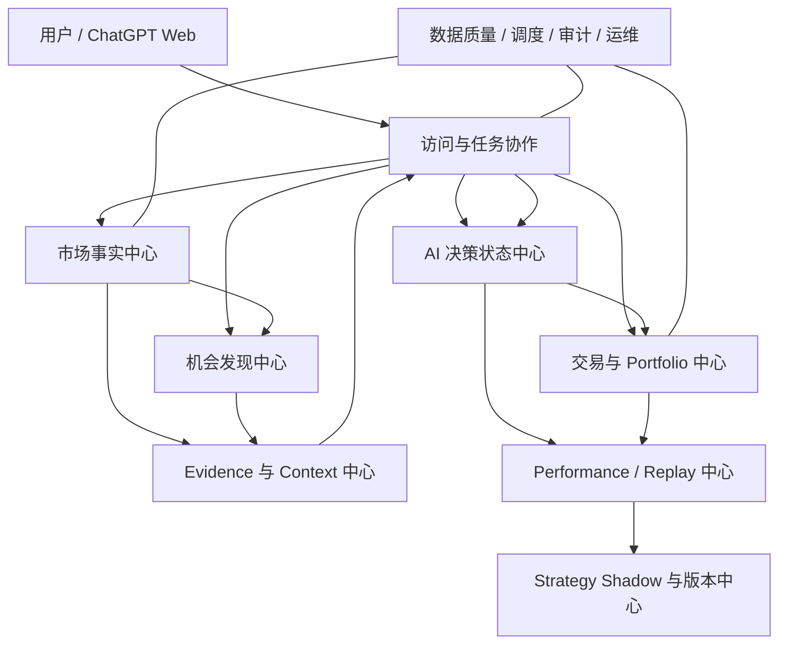

# gpt-market V3 系统功能架构

> 基线：V3 Architecture Baseline 1.0
> 目的：描述系统由哪些业务功能域组成、域之间怎样协作，以及当前与目标能力边界。

## 1. 功能架构总览



## 2. 功能域清单

| 功能域 | 核心职责 | 当前状态 |
|---|---|---|
| 访问与任务协作 | MCP/REST/GPT Web、Task Profile/Run、AI Result Import | 读取部分已实现，V3 协作待实现 |
| 市场事实中心 | Universe、Quote、Kline、Sector、Fundamental、Regime | V1/V2 部分已实现，V3 全市场化待实现 |
| 机会发现中心 | Full Features、Query、Multi-Recall、Raw、Comparison | V2 有扫描，V3 待实现 |
| Evidence 与 Context | 采集、去重、冲突、检索、三级 Context | 待实现 |
| AI 决策状态中心 | MarketReview、Watchlist、Decision、EntryPlan、Review | 待实现 |
| 交易与 Portfolio | Trade Draft/Ledger、Opening、Reconciliation、Position | 待实现 |
| Performance / Replay | 分项评价、时点回放、Regression、Recall Miss | 待实现 |
| Strategy | Proposal、Replay、Shadow、A/B、人工激活 | 待实现 |
| 数据质量与运维 | Coverage、Freshness、Fallback、Audit、Feature Flag | 当前部分已实现，V3 待扩展 |

## 3. 访问与任务协作域

### 3.1 当前入口

- Remote MCP：面向 ChatGPT 或 MCP 客户端的只读工具；
- REST：健康检查、调试和 JSON 读取；
- GPT Web Adapter：Secret 路由、Live HTML、Coverage 和 V2 看板；
- HTML：只供人类查看；机器读取以 JSON 为准。

### 3.2 V3 目标入口

- 全市场、Recall、Evidence、Context、Watchlist、Portfolio、Performance READ API；
- Task Profile 与 Expected Run 查询；
- AI Result Single/Bundle 导入、预览和一次确认；
- 手工成交、截图 Draft、Opening Position 和 Reconciliation；
- Strategy Proposal/Replay/人工审批。

### 3.3 任务功能

Task Profile 定义 Schedule、Timezone、Trading Calendar、Context Level、候选数量、TopK、输出 Schema 和宽限期。Expected Run 只表示“预期 ChatGPT 任务应发生”，不表示服务器已经调用 AI。

## 4. 市场事实中心

### 4.1 Universe

负责完整证券集合、上市/退市/停牌/风险状态、来源覆盖和历史 Snapshot。目标链路：

```text
Primary Universe → Secondary Universe → Last-Known-Good
```

所有降级必须带 `source`、`stale`、`known_at` 和 Coverage。

### 4.2 Quote 与 Market

负责标准化单股/批量实时行情、指数、市场宽度、成交额和质量。当前由 `MarketDataService`、Provider Manager 和 DataQualityService 承担。

### 4.3 Kline 与 Feature

负责 raw/unadjusted Bar、Adjustment Factor、派生复权序列、日 K 增量、周/月聚合和版本化 Feature Run。全市场每天计算轻量特征，分钟周期只服务 Action、Watchlist 和 Portfolio。

### 4.4 Fundamental 与 Market Regime

Phase2A 已有基本面读取与评分，但 V3 要把财务事实转为带报告期、来源、覆盖和冲突的标准数据。MarketRegimeSnapshot 只记录指数、宽度、风格、轮动和风险事实，不形成买卖禁令。

## 5. 机会发现中心

### 5.1 Full Universe Query

支持全市场任意白名单特征的过滤、排序、分页和行业横比。它是完整访问通道，不能受 Recall 限制。

### 5.2 Multi-Recall

通过低位转强、趋势启动、首次突破、首次回踩、相对强度、量能扩张、基本面改善等多个通道提高发现效率。每个结果保存通道、原因、排名、版本和覆盖。

### 5.3 Raw、Comparison 与 Action

```text
Full Universe / Recall
→ Raw Opportunity N
→ CandidateComparisonPack（20–100）
→ ChatGPT 横向 N→TopK
→ TopK NORMAL/DEEP Context
→ AI 判断 Action Candidate
→ Entry Plan
```

系统只提供事实和可解释信号，不输出 `final_total_score` 等固定最终分。Action 是 AI 结论，不是机器硬筛选。

### 5.4 Recall Miss

评价窗口成熟后，识别后续明显优秀但未命中任何通道的股票，按通道、行业和市场环境分析漏失原因。

## 6. Evidence 与 Context 中心

### 6.1 Evidence Ingestion

```text
Provider → Fetch → Raw Document → Parse → Dedup → Normalize
→ 时间标准化 → Entity Link → 类型/置信度/相关性
→ Conflict → Decay/Expire → Evidence DB
```

Core 优先官方公告、财务/业绩、已有 Vendor、基础新闻和重要国内政策；Extended 后续扩展海外、地缘、商品、媒体和 Opinion。

### 6.2 Evidence 分类

- FACT；
- OFFICIAL_DISCLOSURE；
- VENDOR_DATA；
- NEWS；
- OPINION。

Opinion 永远不能因数量多自动变为 Fact。外部文本始终是 Untrusted Data。

### 6.3 Context Pack

- FAST：2k–4k；
- NORMAL：5k–8k；
- DEEP：10k–14k；
- Candidate Comparison：20–100 只的紧凑横向上下文。

每个 Pack 绑定时点、Snapshot、Feature、Evidence Selection、Hash 和裁剪说明。

## 7. AI 决策状态中心

### 7.1 结果类型

`MarketReview`、`CandidateComparisonResult`、`DecisionResult`、`WatchlistProposal`、`EntryPlanResult`、`ReviewResult`、`PositionReviewResult`。

### 7.2 Batch / Bundle

一次 ChatGPT 输出可含多个 Atomic Group。相同股票相互依赖的 Decision/Entry/Watchlist/Review 同组原子提交；不同股票和 MarketReview 分组提交。用户一次确认，结果返回成功组和失败组。

### 7.3 状态边界

- Decision 不可修改，纠错追加；
- Review 和 MarketReview 只追加；
- Watchlist 是分析状态，不是持仓；
- Entry Trigger 不是 BUY；
- AI 的 SELL 建议不是实际 SELL。

## 8. 交易与 Portfolio 中心

### 8.1 真实资金事实

只有用户确认的 ActualTrade、Opening Position、Reconciliation 和 Corporate Action Adjustment 可以改变 Portfolio 事实。

### 8.2 输入方式

- 网站快速录入 BUY/SELL；
- 成交截图 → Trade Draft → 用户确认；
- 持仓截图 → Position/Opening Draft → 用户确认；
- V4 才考虑券商 API。

### 8.3 Position Projection

Portfolio 由不可变 Ledger 和 Opening 基准重建。Projection 是性能缓存，可删除重算。Portfolio Context 提供真实数量、成本、收益、交易历史、Decision、Entry、Review、市场和 Evidence 给 AI。

### 8.4 Execution Deviation

区分计划与执行的价格、时间、数量、Trigger 和取消条件偏差，以免用户追高或自主交易污染 AI Entry 评价。

## 9. Performance、Replay 与 Strategy

### 9.1 Performance

分别评价 Selection、Initial Entry、User Execution、Add、Reduce、Final Exit、Risk Control。未成交股票只评价 Selection；自主成交不计为 AI Entry。

### 9.2 Replay

严格限制 `known_at <= replay_as_of`，绑定 Bar/Factor/Feature/Evidence/Context Revision。只有前复权历史时标记 `LIMITED`，不能宣称完全时点精确。

### 9.3 Strategy

AI 可生成 Strategy Proposal，但 Replay、Shadow、A/B、Guardrail 和用户审批完成前不能激活。V3 禁止 AI 自动修改正式策略。

## 10. 横向业务流程

### 10.1 盘后发现与导入

```text
后台更新事实 → Full Feature/Recall → Comparison Pack
→ ChatGPT N→TopK → TopK 深度 Context
→ AIResultBundle → Preview → 用户一次确认
→ MarketReview/Decision/Watchlist/Entry/Review 分组入库
```

### 10.2 真实交易与持仓 Review

```text
Entry Plan → 用户真实成交/截图 → Draft → 用户确认
→ Trade Ledger → Position Projection
→ Position Context → ChatGPT Review
→ 建议动作 → 用户决定 → 新的真实成交
```

### 10.3 复盘

```text
Decision/Review/Trade + 成熟未来行情
→ Performance Observation
→ 分项归因 + Recall Miss + Regime 分组
→ Regression / Strategy Proposal
→ Shadow / 人工审批
```

## 11. 功能边界

- 行情事实不得由 AI 生成；
- AI 结论不得直接改真实持仓；
- Portfolio 偏好不得成为全市场硬过滤；
- Market Regime 不得成为固定买卖开关；
- HTML 不作为机器数据契约；
- V4 能力不得成为 V3 运行依赖。

## 12. 与实现文档的关系

- “为什么和要什么”：本功能架构与《需求规格说明》；
- “用什么技术”： 《技术架构设计》；
- “数据如何保存”： 《数据库设计》；
- “模块/API/流程如何落地”： 《详细设计》；
- “下一步按什么顺序改”： 《架构设计实施稿》；
- “现在做到了哪里”： 《功能清单与开发状态》和《工作状态》。
